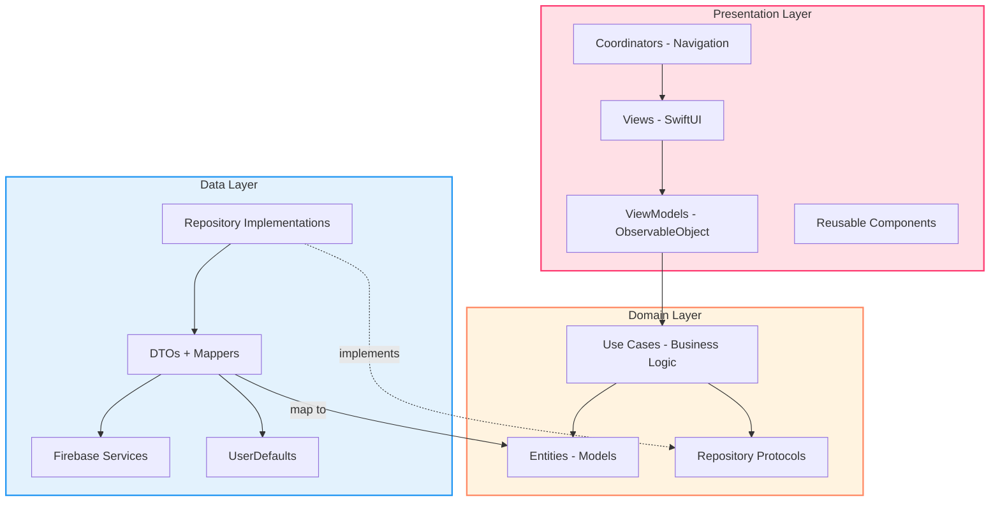
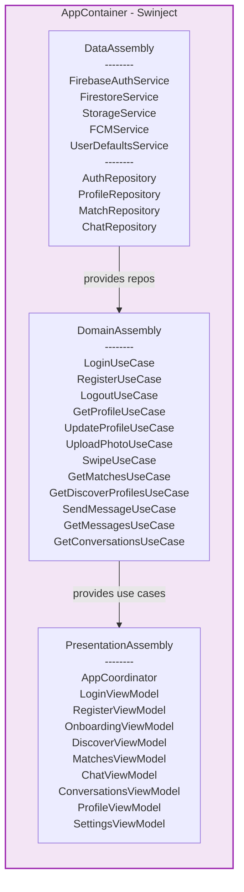
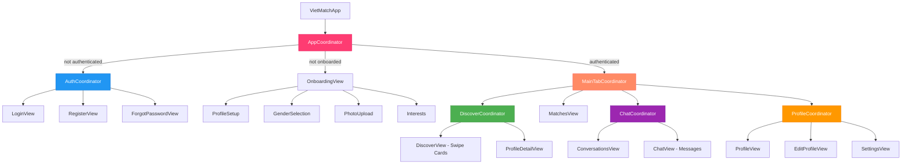
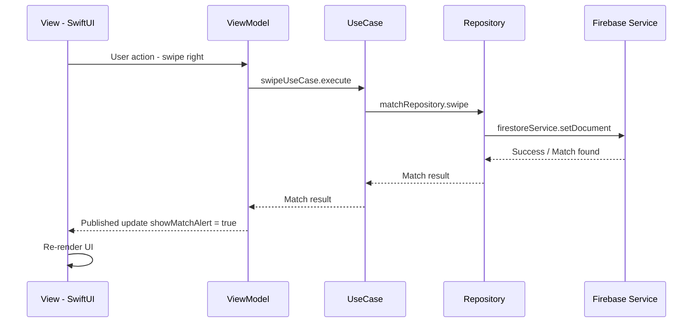
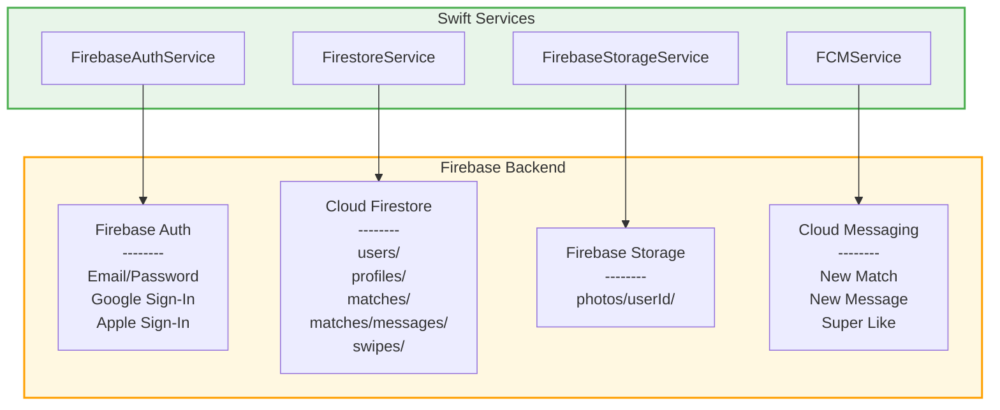
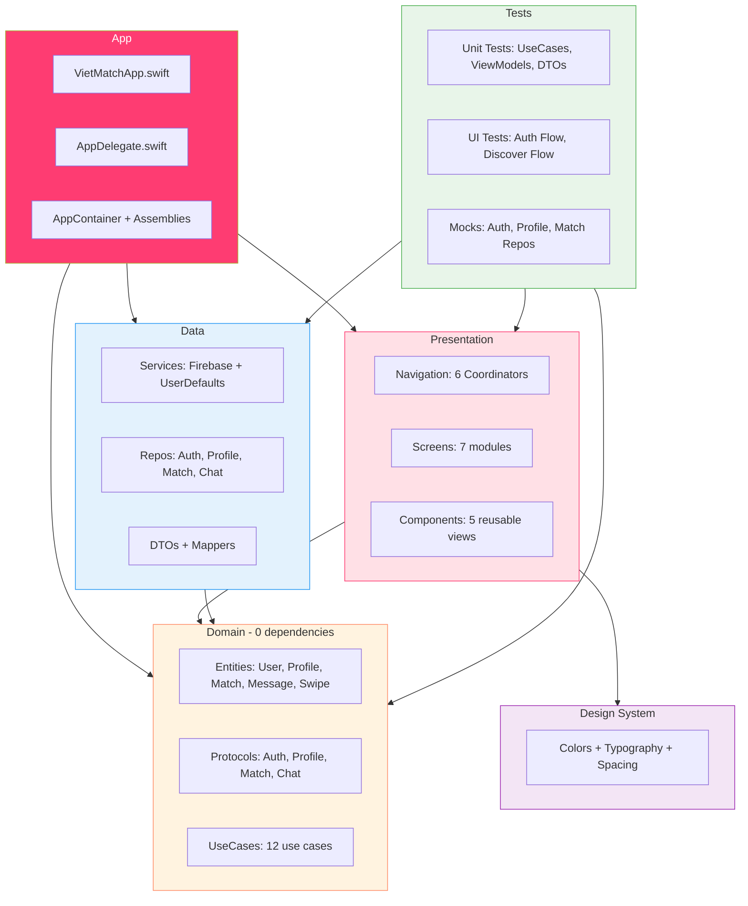

# VietMatch - Architecture Documentation

## 1. Clean Architecture Layers



---

## 2. Dependency Injection Flow (Swinject)



---

## 3. Navigation Flow (Coordinator Pattern)



---

## 4. Data Flow (MVVM Pattern)



---

## 5. Firebase Services Map



---

## 6. Project Module Map



---

## 7. Folder Structure

```
VietMatch/
├── App/
│   ├── VietMatchApp.swift
│   ├── AppDelegate.swift
│   └── DI/
│       ├── AppContainer.swift
│       ├── DataAssembly.swift
│       ├── DomainAssembly.swift
│       └── PresentationAssembly.swift
│
├── Domain/
│   ├── Entities/          (User, Profile, Match, Message, Swipe, Notification)
│   ├── UseCases/          (Auth, Profile, Matching, Chat)
│   └── Repositories/      (Protocol definitions only)
│
├── Data/
│   ├── Repositories/      (Protocol implementations)
│   ├── DataSources/
│   │   ├── Remote/        (Firebase Auth, Firestore, Storage, FCM)
│   │   └── Local/         (UserDefaults)
│   ├── DTOs/              (UserDTO, ProfileDTO, MessageDTO, MatchDTO)
│   └── Mappers/           (UserMapper, MessageMapper)
│
├── Presentation/
│   ├── Navigation/        (Coordinator, App, Auth, MainTab, Discover, Chat, Profile)
│   ├── Screens/           (Auth, Onboarding, Discover, Matches, Chat, Profile, Settings)
│   └── Components/        (SwipeCardStack, GradientButton, ProfileImage, Loading, EmptyState)
│
├── DesignSystem/          (Colors, Typography, Spacing)
│
├── Core/
│   ├── Extensions/        (View, Color, String)
│   ├── Networking/        (NetworkMonitor, APIError)
│   └── Utils/             (Logger, Constants)
│
├── VietMatchTests/        (Unit Tests + Mocks)
└── VietMatchUITests/      (UI Tests)
```

---

## 8. Tech Stack

| Category | Technology |
|----------|-----------|
| Language | Swift 5.9+ |
| UI Framework | SwiftUI |
| iOS Target | iOS 16+ |
| Architecture | MVVM + Clean Architecture |
| Navigation | Coordinator Pattern + NavigationStack |
| DI | Swinject |
| Backend | Firebase (Auth, Firestore, Storage, FCM) |
| Networking | Alamofire |
| Image Loading | Kingfisher |
| Reactive | Combine + async/await |
| Package Manager | SPM |
| Testing | XCTest (Unit + UI) |
