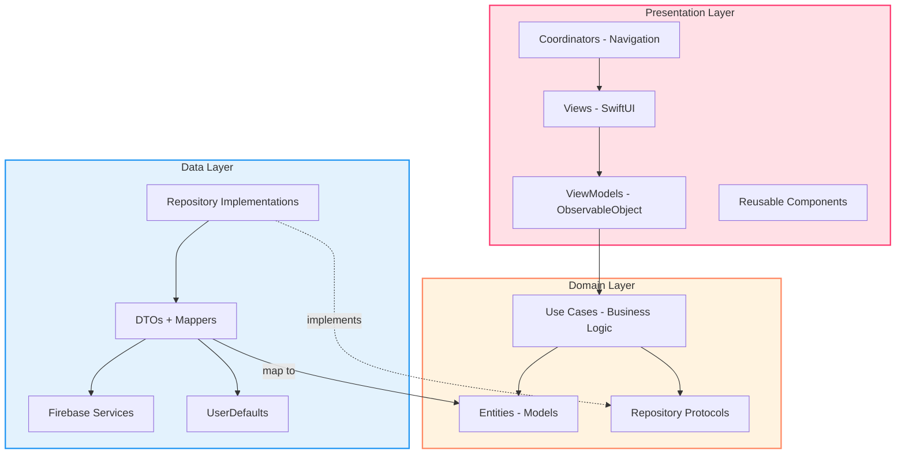
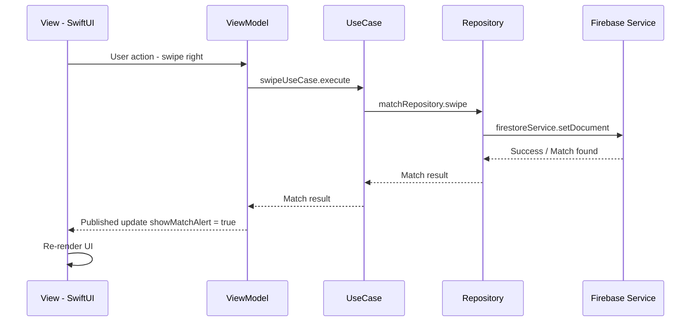
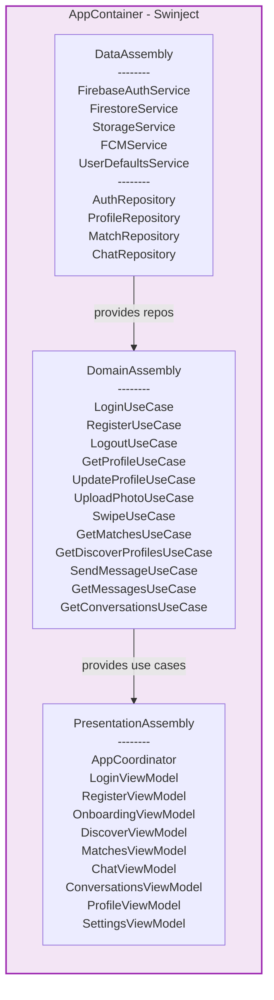
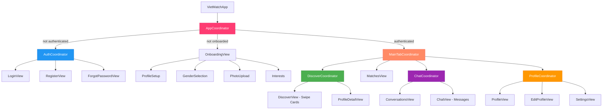
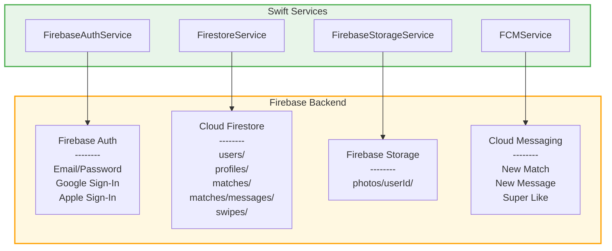

# VietMatch - Tài Liệu Kiến Trúc

> Ngày tạo: 2026-03-26 | Scan Level: Deep | Loại: Mobile (iOS Native)

---

## 1. Tóm Tắt

VietMatch là ứng dụng hẹn hò iOS được xây dựng theo kiến trúc **Clean Architecture + MVVM-C**, sử dụng **Firebase** làm backend. Ứng dụng chia thành 3 layer chính (Presentation, Domain, Data) với nguyên tắc dependency inversion thông qua **Swinject**.

---

## 2. Kiến Trúc Pattern

### Clean Architecture (3 Layers)

Sắp xếp từ **High-level** (ít thay đổi, gần business rules) đến **Low-level** (thay đổi thường xuyên, gần infrastructure):

| Level | Layer | Trách nhiệm | Dependencies |
|-------|-------|-------------|-------------|
| Highest | **Domain** | Business logic (UseCases), Entities, Repository protocols | Không có — layer độc lập nhất |
| Mid | **Presentation** | UI (SwiftUI), ViewModels, Navigation (Coordinators) | Domain |
| Lowest | **Data** | Firebase services, Repository implementations, DTOs, Mappers | Domain (protocols) |

> **Nguyên tắc DIP:** Domain (high-level) định nghĩa protocols. Data (low-level) implements chúng. Đổi Firebase → Supabase chỉ sửa Data layer — Domain và Presentation không thay đổi.



### MVVM-C Pattern

```
View (SwiftUI) → ViewModel (@MainActor, @Published) → UseCase → Repository → Firebase
     ↑
Coordinator (Navigation, NavigationStack)
```

#### Data Flow (Ví dụ: Swipe Right)



### Dependency Flow

```
Presentation → Domain ← Data
     ↓              ↑
   Swinject Container (DI)
```

---

## 3. Dependency Injection (Swinject)

### AppContainer

```swift
AppContainer
├── DataAssembly        // Firebase services + Repository implementations
├── DomainAssembly      // 12 Use Cases (inject repositories)
└── PresentationAssembly // Coordinators + ViewModels (inject use cases)
```

### Đăng Ký

| Assembly | Đăng ký | Số lượng |
|----------|---------|---------|
| **DataAssembly** | FirebaseAuthService, FirestoreService, FirebaseStorageService, FCMService, UserDefaultsService, 4 Repositories | 9 |
| **DomainAssembly** | LoginUseCase, RegisterUseCase, LogoutUseCase, GetProfileUseCase, UpdateProfileUseCase, UploadPhotoUseCase, SwipeUseCase, GetMatchesUseCase, GetDiscoverProfilesUseCase, SendMessageUseCase, GetMessagesUseCase, GetConversationsUseCase | 12 |
| **PresentationAssembly** | AppCoordinator, 6 ViewModels (Login, Register, Onboarding, Discover, Matches, Chat, Conversations, Profile, Settings) | ~10 |



---

## 4. Navigation (Coordinator Pattern)

### Phân Cấp Coordinator

```
AppCoordinator (Root)
│
├── [Chưa xác thực] → AuthCoordinator
│   ├── LoginView
│   ├── RegisterView
│   └── ForgotPasswordView
│
├── [Chưa onboard] → OnboardingView (4 steps)
│   ├── Step 1: ProfileSetupView (name, age, bio)
│   ├── Step 2: Gender selection
│   ├── Step 3: PhotoUploadView (max 6 photos)
│   └── Step 4: Interests selection (15 options)
│
└── [Đã xác thực] → MainTabCoordinator (4 tabs)
    ├── Tab 1: DiscoverCoordinator
    │   ├── DiscoverView (swipe cards)
    │   └── ProfileDetailView
    ├── Tab 2: MatchesView
    ├── Tab 3: ChatCoordinator
    │   ├── ConversationsView
    │   └── ChatView(matchId)
    └── Tab 4: ProfileCoordinator
        ├── ProfileView
        ├── EditProfileView
        └── SettingsView
```

### Route Enums

| Coordinator | Routes |
|-------------|--------|
| AppCoordinator | login, register, onboarding, mainTab, profileDetail, chat, editProfile, settings |
| AuthCoordinator | login, register, forgotPassword |
| DiscoverCoordinator | discover, profileDetail(profileId) |
| ChatCoordinator | conversations, chat(matchId) |
| ProfileCoordinator | profile, editProfile, settings |



---

## 5. Domain Layer

### Entities

| Entity | Thuộc tính chính | Enums liên quan |
|--------|-----------------|----------------|
| **User** | id, email, displayName, profileCompleted, createdAt, lastActiveAt | - |
| **Profile** | id, name, age, bio, gender, interestedIn, photos, location, interests, jobTitle, company, school, distancePreference, ageRange | Gender (male/female/other) |
| **Match** | id, userId, matchedUserId, matchedProfile, createdAt, lastMessageAt, isNew | - |
| **Message** | id, matchId, senderId, content, type, createdAt, isRead | MessageType (text/image/gif) |
| **Conversation** | id, match, lastMessage, unreadCount | - |
| **Swipe** | id, swiperId, swipedUserId, direction, createdAt | SwipeDirection (like/dislike/superLike) |
| **AppNotification** | id, userId, type, title, body, data, isRead | NotificationType (newMatch/newMessage/superLike/profileView) |

### Repository Protocols

| Protocol | Phương thức | Real-time |
|----------|------------|-----------|
| **AuthRepositoryProtocol** | login, register, loginWithGoogle, loginWithApple, logout, resetPassword, deleteAccount | currentUser Publisher |
| **ProfileRepositoryProtocol** | getProfile, updateProfile, uploadPhoto, deletePhoto, updateLocation | - |
| **MatchRepositoryProtocol** | swipe, getMatches, getDiscoverProfiles, unmatch | observeMatches Publisher |
| **ChatRepositoryProtocol** | sendMessage, getMessages, getConversations, markAsRead | observeMessages, observeConversations Publishers |

### Use Cases (12)

| Nhóm | Use Cases | Validation |
|------|-----------|------------|
| **Auth** | LoginUseCase, RegisterUseCase, LogoutUseCase | Email/password not empty, password >= 6 chars |
| **Profile** | GetProfileUseCase, UpdateProfileUseCase, UploadPhotoUseCase | - |
| **Matching** | SwipeUseCase, GetMatchesUseCase, GetDiscoverProfilesUseCase | - |
| **Chat** | SendMessageUseCase, GetMessagesUseCase, GetConversationsUseCase | Message not empty (trimmed) |

---

## 6. Data Layer

### Firebase Services

| Service | Firebase Product | Chức năng |
|---------|-----------------|-----------|
| **FirebaseAuthService** | Firebase Auth | Email/password, Google, Apple sign-in |
| **FirestoreService** | Cloud Firestore | Generic CRUD, real-time observers, filters |
| **FirebaseStorageService** | Firebase Storage | Upload/delete images (JPEG, path: photos/{userId}/{UUID}.jpg) |
| **FCMService** | Cloud Messaging | Push permissions, token, topic subscribe |
| **UserDefaultsService** | UserDefaults | Onboarding state, userId, FCM token, last refresh |



### Firestore Collections

```
Firestore
├── users/                  # Thông tin tài khoản
│   └── {userId}            # UserDTO: email, display_name, profile_completed, created_at
│
├── profiles/               # Hồ sơ chi tiết
│   └── {userId}            # ProfileDTO: name, age, bio, gender, photos[], location, interests[]
│
├── matches/                # Các cặp match
│   └── {matchId}           # MatchDTO: user_id, matched_user_id, created_at, is_new
│       └── messages/       # Subcollection tin nhắn
│           └── {messageId} # MessageDTO: sender_id, content, type, is_read
│
└── swipes/                 # Lịch sử swipe
    └── {swipeId}           # swiper_id, swiped_user_id, direction, created_at
```

### DTO Mapping

Tất cả DTOs sử dụng `Codable` với custom `CodingKeys` (snake_case ↔ camelCase):

```
UserDTO ↔ User          (timestamp Double ↔ Date)
ProfileDTO ↔ Profile    (lat/lng ↔ Location struct)
MatchDTO ↔ Match        (timestamp Double ↔ Date)
MessageDTO ↔ Message    (type String ↔ MessageType enum)
```

### UserDefaults Keys

| Key | Type | Mục đích |
|-----|------|---------|
| `has_completed_onboarding` | Bool | Trạng thái onboarding |
| `current_user_id` | String | ID người dùng đang đăng nhập |
| `fcm_token` | String | Firebase Cloud Messaging token |
| `last_discover_refresh` | Date | Thời gian refresh danh sách khám phá |

---

## 7. Presentation Layer

### ViewModels

| ViewModel | Use Cases | @Published Properties |
|-----------|-----------|----------------------|
| **LoginViewModel** | LoginUseCase | email, password, isLoading, errorMessage, showError |
| **RegisterViewModel** | RegisterUseCase | displayName, email, password, confirmPassword, isLoading, passwordMismatch |
| **OnboardingViewModel** | UpdateProfileUseCase, UploadPhotoUseCase | currentStep, name, age, bio, gender, selectedPhotos, interests |
| **DiscoverViewModel** | GetDiscoverProfilesUseCase, SwipeUseCase | profiles, currentIndex, isLoading, showMatchAlert, matchedProfile |
| **MatchesViewModel** | GetMatchesUseCase | matches, isLoading, errorMessage |
| **ChatViewModel** | GetMessagesUseCase, SendMessageUseCase | messages, messageText, isLoading, isSending |
| **ConversationsViewModel** | GetConversationsUseCase | conversations, isLoading, errorMessage |
| **ProfileViewModel** | GetProfileUseCase, UpdateProfileUseCase, LogoutUseCase | profile, isLoading, isEditing, editName/Bio/JobTitle |
| **SettingsViewModel** | LogoutUseCase | distancePreference, ageRange, showLogoutConfirmation |

### Reusable Components

| Component | Props | Mô tả |
|-----------|-------|-------|
| **SwipeCardStack** | data, onSwipeLeft/Right, content builder | Card stack với 3D scale effect |
| **GradientButton** | title, icon, isLoading, action | Primary button với gradient |
| **ProfileImageView** | url, size, showBorder | Circle avatar (Kingfisher) |
| **LoadingView** | message | Spinner + message |
| **EmptyStateView** | icon, title, message, actionTitle, action | Empty state với optional CTA |

---

## 8. Design System

### Colors

| Token | Hex | Sử dụng |
|-------|-----|---------|
| primary | #FE3C72 | Brand color chính (Hot Pink) |
| primaryLight | #FF6B6B | Gradient start |
| primaryDark | #E91E63 | Gradient end |
| secondary | #FF8A65 | Secondary actions |
| accent | #FFD54F | Highlights |
| background | #FAFAFA | App background |
| success | #4CAF50 | Like / success |
| error | #F44336 | Dislike / error |
| info | #2196F3 | Super Like |

### Typography

Font family: **SF Pro Rounded** (system rounded design)

| Style | Size | Weight |
|-------|------|--------|
| largeTitle | 34 | Bold |
| title1 | 28 | Bold |
| title2 | 22 | Semibold |
| headline | 17 | Semibold |
| body | 17 | Regular |
| cardName | 28 | Bold |
| cardAge | 24 | Light |

---

## 9. Async & Reactive Patterns

| Pattern | Sử dụng |
|---------|---------|
| **async/await** | Tất cả UseCase.execute(), Repository methods |
| **Combine Publishers** | Real-time Firestore observers (matches, messages, conversations) |
| **@Published** | ViewModel state management |
| **@MainActor** | Tất cả ViewModels (UI updates on main thread) |

---

## 10. Error Handling

| Error Type | Cases | Localization |
|------------|-------|-------------|
| **AuthError** | invalidCredentials, userNotFound, emailAlreadyInUse, weakPassword, unknown | Vietnamese |
| **ChatError** | emptyMessage, matchNotFound, sendFailed | Vietnamese |
| **APIError** | networkError, serverError(Int), decodingError, unauthorized, notFound, unknown | Vietnamese |

---

## 11. Testing Strategy

| Layer | Test Type | Coverage |
|-------|-----------|----------|
| **Data** | DTO mapping tests | UserDTO, ProfileDTO (location mapping) |
| **Domain** | UseCase logic tests | LoginUseCase (validation, error), SwipeUseCase (match detection) |
| **Presentation** | ViewModel tests | LoginViewModel (form validation), DiscoverViewModel (profile loading) |
| **E2E** | UI tests | Auth flow (elements, navigation), Discover flow (tabs) |
| **Mocks** | 3 mock repositories | Configurable results, call counting |
