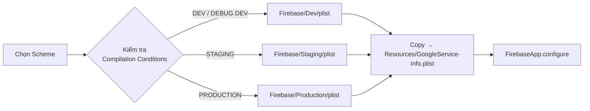
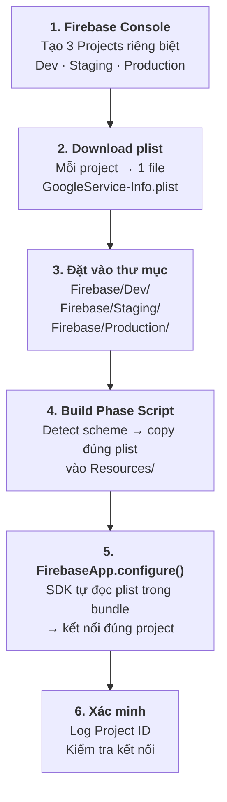

# Firebase Setup

> Hướng dẫn cài đặt và cấu hình Firebase theo từng môi trường — Console, SDK, Security Rules, Build Phase

---

## Tổng quan môi trường

VietMatch sử dụng **3 môi trường** riêng biệt, mỗi môi trường tương ứng với một **Firebase Project** độc lập:

| Môi trường | Bundle ID | Tên App | Scheme | Firebase Project |
|------------|-----------|---------|--------|-----------------|
| **Dev** | `com.vietmatch.app.dev` | VM Dev | `VietMatch-Dev` | `VietMatch-Dev` |
| **Staging** | `com.vietmatch.app.staging` | VM Staging | `VietMatch-Staging` | `VietMatch-Staging` |
| **Production** | `com.vietmatch.app` | VietMatch | `VietMatch-Production` | `VietMatch-Production` |

Mỗi Firebase Project có riêng: Database, Storage, Auth providers, FCM keys. Điều này đảm bảo dữ liệu các môi trường hoàn toàn cách ly.

> Hình dung thế này: Mỗi Firebase Project giống như một "căn phòng" riêng — dev thoải mái thử nghiệm trong phòng Dev mà không sợ ảnh hưởng gì đến phòng Production.

---

## 1. Tạo Firebase Projects trên Console

Lặp lại các bước dưới đây cho **mỗi môi trường** (Dev, Staging, Production):

1. Truy cập [Firebase Console](https://console.firebase.google.com/).
2. Chọn **"Add project"** → Nhập tên theo quy ước:
   - `VietMatch-Dev`
   - `VietMatch-Staging`
   - `VietMatch-Production`
3. *Khuyến nghị:* Bật **Google Analytics** (tạo property riêng cho mỗi project).
4. Nhấn **"Create project"**.

### Thêm ứng dụng iOS vào từng Project

Trên Dashboard của **mỗi Firebase Project**:

1. Nhấp biểu tượng **iOS** → **Register app**.
2. Nhập **Bundle ID** tương ứng với môi trường:

   | Firebase Project | Bundle ID |
   |-----------------|-----------|
   | VietMatch-Dev | `com.vietmatch.app.dev` |
   | VietMatch-Staging | `com.vietmatch.app.staging` |
   | VietMatch-Production | `com.vietmatch.app` |

3. **Download** file `GoogleService-Info.plist` và đổi tên/lưu theo cấu trúc thư mục ở [Mục 4](#4-cấu-trúc-thư-mục-googleservice-infoplist).

> **Bundle ID phải khớp chính xác** giữa Firebase Console và `project.yml`. Nếu sai, Firebase SDK sẽ crash ngay khi khởi động.

---

## 2. Khởi tạo các dịch vụ Firebase (Services)

Thực hiện trên **cả 3 Firebase Projects**. Tùy giai đoạn, có thể setup Dev trước rồi Staging/Production sau.

### 2.1. Firebase Authentication

1. **Build > Authentication** → "Get started" → Tab **Sign-in method**.
2. Bật các provider:

| Provider | Dev | Staging | Production | Ghi chú |
|----------|-----|---------|------------|---------|
| Email/Password | Bật | Bật | Bật | Cơ bản, dùng cho mọi môi trường |
| Google Sign-In | Bật | Bật | Bật | Mỗi project có `CLIENT_ID` riêng trong plist |
| Apple Sign-In | Tùy chọn | Bật | Bật | Cần cấu hình Service ID trên Apple Developer |

**Lưu ý Google Sign-In:** Mỗi Firebase Project sinh ra một `CLIENT_ID` và `REVERSED_CLIENT_ID` khác nhau trong file `GoogleService-Info.plist`. Giá trị này được dùng trong `Info.plist` (URL Schemes) — xem chi tiết tại [Mục 6](#6-cấu-hình-url-schemes-cho-google-sign-in).

**Lưu ý Apple Sign-In:** Cần đăng ký Service ID trên [Apple Developer Portal](https://developer.apple.com/) cho mỗi Bundle ID. Tham khảo [tài liệu Firebase](https://firebase.google.com/docs/auth/ios/apple).

### 2.2. Cloud Firestore

1. **Build > Firestore Database** → "Create database".
2. Chọn **Location** phù hợp (khuyến nghị `asia-southeast1` cho Đông Nam Á).
3. Áp dụng **Security Rules** theo môi trường:

**Dev** — Cho phép rộng để tiện phát triển (có thời hạn):
```javascript
rules_version = '2';
service cloud.firestore {
  match /databases/{database}/documents {
    match /{document=**} {
      allow read, write: if request.auth != null;
    }
  }
}
```

**Staging** — Giống Production nhưng có thêm log/debug nếu cần:
```javascript
rules_version = '2';
service cloud.firestore {
  match /databases/{database}/documents {
    match /users/{userId} {
      allow read: if request.auth != null;
      allow write: if request.auth != null && request.auth.uid == userId;
    }
    match /profiles/{userId} {
      allow read: if request.auth != null;
      allow write: if request.auth != null && request.auth.uid == userId;
    }
    match /matches/{matchId} {
      allow read: if request.auth != null &&
        (resource.data.userId1 == request.auth.uid ||
         resource.data.userId2 == request.auth.uid);
      allow write: if false; // Chỉ Cloud Functions xử lý
    }
    match /swipes/{swipeId} {
      allow create: if request.auth != null && request.resource.data.userId == request.auth.uid;
      allow read: if request.auth != null && resource.data.userId == request.auth.uid;
    }
    match /messages/{messageId} {
      allow read, write: if request.auth != null;
    }
  }
}
```

**Production** — Rules chặt chẽ nhất, chỉ cho phép đúng quyền cần thiết (giống Staging ở trên hoặc chặt hơn tùy yêu cầu nghiệp vụ).

### 2.3. Firebase Storage

1. **Build > Storage** → "Get started".
2. Áp dụng **Storage Rules** theo môi trường:

**Dev:**
```javascript
rules_version = '2';
service firebase.storage {
  match /b/{bucket}/o {
    match /photos/{userId}/{allPaths=**} {
      allow read: if request.auth != null;
      allow write: if request.auth != null && request.auth.uid == userId;
    }
  }
}
```

**Staging & Production** — Thêm giới hạn kích thước và loại file:
```javascript
rules_version = '2';
service firebase.storage {
  match /b/{bucket}/o {
    match /photos/{userId}/{allPaths=**} {
      allow read: if request.auth != null;
      allow write: if request.auth != null
                   && request.auth.uid == userId
                   && request.resource.size < 10 * 1024 * 1024  // Max 10MB
                   && request.resource.contentType.matches('image/.*');
    }
  }
}
```

### 2.4. Firebase Cloud Messaging (FCM)

Trên **mỗi Firebase Project**:

1. Vào **Project Settings > Cloud Messaging**.
2. Trong **Apple app configuration**, upload **APNs Auth Key (.p8)** từ Apple Developer.

> APNs Auth Key (.p8) có thể dùng chung cho cả 3 môi trường vì key gắn với Team ID, không gắn với Bundle ID. Chỉ cần upload cùng file .p8 lên cả 3 Firebase Projects.

---

## 3. Tích hợp Firebase SDK

Dự án đã cấu hình sẵn trong [project.yml](../project.yml) qua **Swift Package Manager**:

```yaml
packages:
  FirebaseSDK:
    url: https://github.com/firebase/firebase-ios-sdk
    from: "11.0.0"

# Dependencies cho target VietMatch:
dependencies:
  - package: FirebaseSDK
    product: FirebaseAuth
  - package: FirebaseSDK
    product: FirebaseFirestore
  - package: FirebaseSDK
    product: FirebaseStorage
  - package: FirebaseSDK
    product: FirebaseMessaging
  - package: FirebaseSDK
    product: FirebaseAnalytics
```

SDK chỉ cần cài một lần — **không cần cài riêng theo môi trường**. Việc phân biệt môi trường nằm ở file `GoogleService-Info.plist` (chứa project ID, API key, client ID riêng).

---

## 4. Cấu trúc thư mục GoogleService-Info.plist

Tạo thư mục chứa file cấu hình Firebase cho từng môi trường:

```
VietMatch/
└── App/
    └── Resources/
        └── Firebase/
            ├── Dev/
            │   └── GoogleService-Info.plist      ← Từ project VietMatch-Dev
            ├── Staging/
            │   └── GoogleService-Info.plist      ← Từ project VietMatch-Staging
            └── Production/
                └── GoogleService-Info.plist      ← Từ project VietMatch-Production
```

Tạo cấu trúc thư mục:
```bash
mkdir -p VietMatch/App/Resources/Firebase/{Dev,Staging,Production}
```

Sau khi download từ Firebase Console, đặt mỗi file `GoogleService-Info.plist` vào đúng thư mục tương ứng.

> **Quan trọng:** Các file trong thư mục `Firebase/` này **KHÔNG được thêm vào Xcode target** (không tick vào Target Membership). Chúng chỉ là nguồn để Build Phase script copy vào đúng vị trí khi build.

---

## 5. Build Phase Script — Tự động chọn plist theo môi trường

Thêm **Run Script Phase** vào `project.yml` để tự động copy đúng file `GoogleService-Info.plist` vào bundle khi build:

### 5.1. Thêm script vào project.yml

Trong section `targets > VietMatch`, thêm `preBuildScripts`:

```yaml
targets:
  VietMatch:
    # ... (các config hiện tại giữ nguyên)
    preBuildScripts:
      - name: "[Firebase] Copy GoogleService-Info.plist"
        script: |
          ENV_NAME="Dev"
          if [[ "${SWIFT_ACTIVE_COMPILATION_CONDITIONS}" == *"STAGING"* ]]; then
            ENV_NAME="Staging"
          elif [[ "${SWIFT_ACTIVE_COMPILATION_CONDITIONS}" == *"PRODUCTION"* ]]; then
            ENV_NAME="Production"
          fi

          PLIST_SOURCE="${SRCROOT}/VietMatch/App/Resources/Firebase/${ENV_NAME}/GoogleService-Info.plist"
          PLIST_DEST="${SRCROOT}/VietMatch/App/Resources/GoogleService-Info.plist"

          if [ -f "${PLIST_SOURCE}" ]; then
            cp "${PLIST_SOURCE}" "${PLIST_DEST}"
            echo "✅ Copied GoogleService-Info.plist from ${ENV_NAME}"
          else
            echo "⚠️ warning: GoogleService-Info.plist not found for ${ENV_NAME} at ${PLIST_SOURCE}"
            echo "⚠️ Firebase sẽ KHÔNG hoạt động. Hãy download file từ Firebase Console."
          fi
```

### 5.2. Cách hoạt động

```
Build VietMatch-Dev scheme
  → SWIFT_ACTIVE_COMPILATION_CONDITIONS chứa "DEV"
  → Script detect: không có STAGING, không có PRODUCTION → mặc định "Dev"
  → Copy Firebase/Dev/GoogleService-Info.plist → Resources/GoogleService-Info.plist
  → FirebaseApp.configure() đọc plist → kết nối đến project VietMatch-Dev
```



### 5.3. Regenerate Xcode project

Sau khi cập nhật `project.yml`, chạy lại XcodeGen:
```bash
xcodegen generate
```

---

## 6. Cấu hình URL Schemes cho Google Sign-In

Mỗi Firebase Project có một `REVERSED_CLIENT_ID` khác nhau (nằm trong `GoogleService-Info.plist`). Giá trị này cần được khai báo trong **Info.plist** để Google Sign-In callback hoạt động.

### Cách lấy REVERSED_CLIENT_ID

Mở file `GoogleService-Info.plist` của **mỗi môi trường** và tìm key `REVERSED_CLIENT_ID`. Ví dụ:

| Môi trường | REVERSED_CLIENT_ID (ví dụ) |
|------------|---------------------------|
| Dev | `com.googleusercontent.apps.111111111111-aaaaaaa` |
| Staging | `com.googleusercontent.apps.222222222222-bbbbbbb` |
| Production | `com.googleusercontent.apps.333333333333-ccccccc` |

### Cấu hình động qua Build Phase

Thêm script nữa vào `preBuildScripts` (hoặc gộp chung với script ở Mục 5) để tự động cập nhật URL Scheme từ plist:

```yaml
    preBuildScripts:
      - name: "[Firebase] Copy GoogleService-Info.plist"
        script: |
          # ... (script copy plist ở trên)

          # Tự động đọc REVERSED_CLIENT_ID và ghi vào Info.plist
          if [ -f "${PLIST_DEST}" ]; then
            REVERSED_ID=$(/usr/libexec/PlistBuddy -c "Print :REVERSED_CLIENT_ID" "${PLIST_DEST}" 2>/dev/null)
            if [ -n "${REVERSED_ID}" ]; then
              /usr/libexec/PlistBuddy -c "Delete :CFBundleURLTypes" "${SRCROOT}/VietMatch/App/Info.plist" 2>/dev/null
              /usr/libexec/PlistBuddy -c "Add :CFBundleURLTypes array" "${SRCROOT}/VietMatch/App/Info.plist"
              /usr/libexec/PlistBuddy -c "Add :CFBundleURLTypes:0 dict" "${SRCROOT}/VietMatch/App/Info.plist"
              /usr/libexec/PlistBuddy -c "Add :CFBundleURLTypes:0:CFBundleURLSchemes array" "${SRCROOT}/VietMatch/App/Info.plist"
              /usr/libexec/PlistBuddy -c "Add :CFBundleURLTypes:0:CFBundleURLSchemes:0 string ${REVERSED_ID}" "${SRCROOT}/VietMatch/App/Info.plist"
              echo "✅ Updated URL Scheme: ${REVERSED_ID}"
            fi
          fi
```

> **Tại sao cần làm thế này?** Google Sign-In dùng URL Scheme để callback về app sau khi xác thực. Mỗi Firebase Project có client ID khác nhau → URL Scheme khác nhau. Script tự động hóa việc này nên developer không cần sửa tay khi chuyển môi trường.

---

## 7. Khởi tạo Firebase trong Source Code

File [AppDelegate.swift](../VietMatch/App/AppDelegate.swift) đã cấu hình sẵn khởi tạo Firebase:

```swift
class AppDelegate: NSObject, UIApplicationDelegate {
    func application(
        _ application: UIApplication,
        didFinishLaunchingWithOptions launchOptions: [UIApplication.LaunchOptionsKey: Any]? = nil
    ) -> Bool {
        if ProcessInfo.processInfo.environment["XCTestConfigurationFilePath"] == nil {
            FirebaseApp.configure()  // Đọc GoogleService-Info.plist trong bundle
            setupNotifications(application)
        }
        return true
    }
    // ...
}
```

`FirebaseApp.configure()` tự động tìm file `GoogleService-Info.plist` trong app bundle. Nhờ Build Phase script ở Mục 5, file này đã được copy đúng theo môi trường → **không cần thay đổi code khi chuyển môi trường**.

### Xác minh môi trường đang kết nối

Để kiểm tra app đang kết nối đúng Firebase Project, thêm log sau khi configure (chỉ chạy ở Debug):

```swift
#if DEBUG
if let app = FirebaseApp.app() {
    AppLogger.general.info("Firebase Project ID: \(app.options.projectID ?? "nil")")
    AppLogger.general.info("Firebase Bundle ID: \(app.options.googleAppID ?? "nil")")
}
#endif
```

---

## 8. Cấu hình .gitignore

File `.gitignore` hiện tại đã khai báo:

```bash
# Firebase
GoogleService-Info.plist
```

Cập nhật thêm để bao phủ cả thư mục Firebase config:

```bash
# Firebase
GoogleService-Info.plist
VietMatch/App/Resources/Firebase/
```

> **Tại sao phải gitignore?** File `GoogleService-Info.plist` chứa API keys, project IDs — đây là thông tin nhạy cảm, đặc biệt nếu repo là public. Mỗi developer cần tự download từ Firebase Console hoặc nhận từ team lead qua kênh an toàn.

---

## 9. Checklist theo từng môi trường

### Dev (Bắt buộc trước khi code)
- [ ] Tạo Firebase Project `VietMatch-Dev` với Bundle ID `com.vietmatch.app.dev`
- [ ] Download `GoogleService-Info.plist` → đặt vào `VietMatch/App/Resources/Firebase/Dev/`
- [ ] Bật Authentication: Email/Password, Google Sign-In
- [ ] Tạo Firestore Database (Test mode, `asia-southeast1`)
- [ ] Tạo Storage Bucket
- [ ] Upload APNs Auth Key (.p8) vào Cloud Messaging
- [ ] Thêm Build Phase script vào `project.yml` và chạy `xcodegen generate`
- [ ] Build thành công với scheme `VietMatch-Dev` (Cmd + B)
- [ ] Kiểm tra log Firebase Project ID đúng với project Dev

### Staging (Trước khi QA/Testing)
- [ ] Tạo Firebase Project `VietMatch-Staging` với Bundle ID `com.vietmatch.app.staging`
- [ ] Download `GoogleService-Info.plist` → đặt vào `VietMatch/App/Resources/Firebase/Staging/`
- [ ] Bật Authentication: Email/Password, Google Sign-In, Apple Sign-In
- [ ] Tạo Firestore Database (Production mode) + áp Security Rules chặt
- [ ] Tạo Storage Bucket + áp Storage Rules có giới hạn file
- [ ] Upload APNs Auth Key (.p8)
- [ ] Build thành công với scheme `VietMatch-Staging`

### Production (Trước khi Release)
- [ ] Tạo Firebase Project `VietMatch-Production` với Bundle ID `com.vietmatch.app`
- [ ] Download `GoogleService-Info.plist` → đặt vào `VietMatch/App/Resources/Firebase/Production/`
- [ ] Bật Authentication: Email/Password, Google Sign-In, Apple Sign-In
- [ ] Tạo Firestore Database (Production mode, `asia-southeast1`) + Security Rules nghiêm ngặt
- [ ] Tạo Storage Bucket + Storage Rules có giới hạn file
- [ ] Upload APNs Auth Key (.p8)
- [ ] Cập nhật Entitlements: `aps-environment` → `production` (trong `project.yml`)
- [ ] Build & Archive thành công với scheme `VietMatch-Production`
- [ ] Kiểm tra Firebase Project ID đúng trong log

---

## Tham khảo nhanh — Luồng End-to-End


