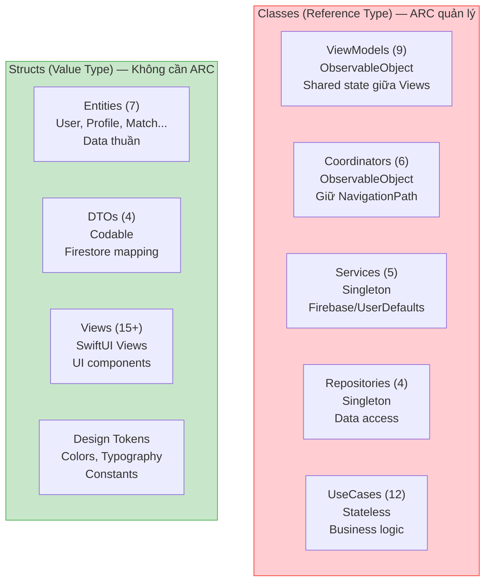
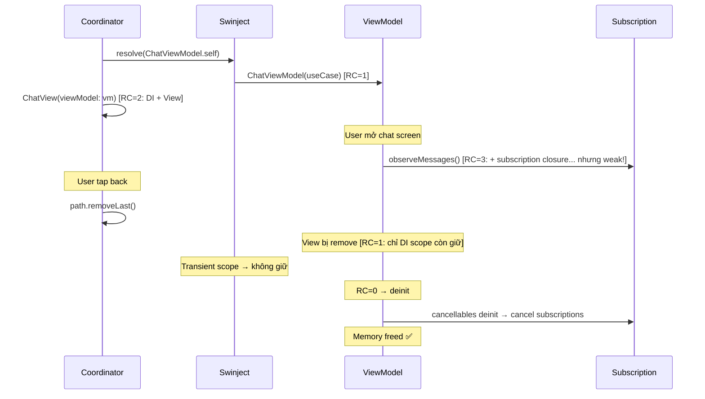

# Kiến Thức: ARC (Automatic Reference Counting) Deep Dive

> Quản lý bộ nhớ trong Swift — từ lý thuyết đến thực hành VietMatch

---

## 1. ARC Là Gì?

ARC là cơ chế Swift **tự động đếm số lượng tham chiếu** đến một object. Khi không còn ai tham chiếu → object bị giải phóng khỏi bộ nhớ.

### Ví von: Phòng khách sạn

- **Object** = phòng khách sạn
- **Reference** = chìa khóa phòng
- **ARC** = lễ tân đếm chìa khóa
- Khi phát chìa khóa cuối cùng → reference count = 1
- Khi khách trả hết chìa khóa → reference count = 0 → **dọn phòng (dealloc)**

```swift
class Room {
    let number: Int
    init(number: Int) { self.number = number; print("Phòng \(number) mở") }
    deinit { print("Phòng \(number) dọn") }
}

var key1: Room? = Room(number: 101)   // RC = 1  → "Phòng 101 mở"
var key2 = key1                        // RC = 2
key1 = nil                             // RC = 1
key2 = nil                             // RC = 0  → "Phòng 101 dọn"
```

---

## 2. ARC Chỉ Áp Dụng Cho Reference Types (Class)

```swift
// CLASS (Reference Type) — ARC quản lý ✅
class LoginViewModel: ObservableObject { ... }  // → ARC đếm references

// STRUCT (Value Type) — ARC KHÔNG quản lý ❌
struct User { ... }  // → Copy khi gán, tự giải phóng khi ra khỏi scope
```

### Trong VietMatch

| Loại | Số lượng | Ví dụ | ARC quản lý? |
|------|---------|-------|-------------|
| **Classes** | 39 | ViewModels, Coordinators, Services, Repositories, UseCases | Co |
| **Structs** | 38+ | Entities, DTOs, Views (SwiftUI), Components | Không |

**Tại sao ViewModels là class?** Vì cần **shared state** — nhiều Views cùng quan sát 1 ViewModel qua `@ObservedObject`. Struct sẽ bị copy → mỗi View có bản sao riêng → state không đồng bộ.

**Tại sao Entities là struct?** Vì là **data thuần** — không cần shared reference. Copy an toàn hơn, thread-safe, không lo retain cycle.

---

## 3. Retain Cycle — Vấn Đề Lớn Nhất Của ARC

### Retain Cycle là gì?

Hai object giữ **strong reference** lẫn nhau → cả hai không bao giờ bị giải phóng → **memory leak**.

```
     strong →
  A ──────── B
  ← strong

  A muốn giải phóng → nhưng B giữ A
  B muốn giải phóng → nhưng A giữ B
  → Cả hai kẹt mãi mãi (zombie objects)
```

### Ví dụ retain cycle

```swift
// ❌ RETAIN CYCLE
class Person {
    var pet: Pet?          // Strong reference to Pet
}

class Pet {
    var owner: Person?     // Strong reference to Person
}

var john: Person? = Person()
var rex: Pet? = Pet()

john?.pet = rex     // Person → Pet (strong)
rex?.owner = john   // Pet → Person (strong) ← CYCLE!

john = nil          // Person RC = 1 (Pet vẫn giữ) → KHÔNG giải phóng
rex = nil           // Pet RC = 1 (Person vẫn giữ) → KHÔNG giải phóng
// → Memory leak! Cả 2 object sống mãi
```

---

## 4. Ba Loại Reference

### 4.1 Strong Reference (Mặc định)

```swift
class ChatViewModel: ObservableObject {
    private let useCase: GetMessagesUseCaseProtocol  // ← Strong (mặc định)
    // ViewModel GIỮU UseCase sống — đúng vì VM cần UseCase hoạt động
}
```

**Dùng khi:** Object **cần** dependency sống cùng mình.

### 4.2 Weak Reference

```swift
class Node {
    weak var parent: Node?   // ← Weak — không tăng RC
    var children: [Node] = []  // ← Strong — giữ children sống
}
// parent bị giải phóng → self.parent tự thành nil
```

**Đặc điểm:**
- Phải là `var` (không thể `let`)
- Phải là **Optional** (`Node?`)
- Tự thành `nil` khi object bị giải phóng
- **Không tăng** reference count

**Dùng khi:** Quan hệ "biết nhau" nhưng **không sở hữu**. Ví dụ: delegate, parent, observer.

### 4.3 Unowned Reference

```swift
class Customer {
    var card: CreditCard?
}

class CreditCard {
    unowned let owner: Customer  // ← Unowned — không Optional
    // Card CHẮC CHẮN có owner — owner luôn sống lâu hơn card
}
```

**Đặc điểm:**
- Có thể là `let`
- **Không cần Optional**
- **Crash nếu truy cập sau khi object bị giải phóng**
- **Không tăng** reference count

**Dùng khi:** Chắc chắn object được tham chiếu **sống lâu hơn** object tham chiếu.

### So sánh

| | `strong` | `weak` | `unowned` |
|---|---|---|---|
| Tăng RC | Co | Không | Không |
| Optional | Tùy | **Bắt buộc** | Không bắt buộc |
| Khi object bị giải phóng | Không xảy ra (vẫn giữ) | Tự thành `nil` | **Crash** nếu truy cập |
| An toàn | An toàn nhất | An toàn | Nguy hiểm |
| VietMatch dùng | Mặc định | 7 chỗ | 0 chỗ |

---

## 5. Retain Cycle Trong Closures — Vấn Đề Phổ Biến Nhất

Closures **capture** biến từ scope bên ngoài bằng **strong reference mặc định**:

```swift
// ❌ RETAIN CYCLE VỚI CLOSURE
class ChatViewModel: ObservableObject {
    var cancellables = Set<AnyCancellable>()

    func observe() {
        somePublisher
            .sink { completion in
                self.errorMessage = "Error"   // ← self captured STRONG
            } receiveValue: { messages in
                self.messages = messages       // ← self captured STRONG
            }
            .store(in: &cancellables)
        //
        // Cycle: ViewModel → cancellables → subscription → closure → ViewModel
        //        ↑___________________________________________________________↓
    }
}
```

```
ViewModel ──strong──→ cancellables ──strong──→ Subscription
    ↑                                              │
    └──────────────── strong (closure) ←───────────┘

    → RETAIN CYCLE → ViewModel không bao giờ bị giải phóng
```

### Giải pháp: `[weak self]`

```swift
// ✅ KHÔNG RETAIN CYCLE — dùng [weak self]
class ChatViewModel: ObservableObject {
    var cancellables = Set<AnyCancellable>()

    func observe() {
        somePublisher
            .sink { [weak self] completion in        // ← weak!
                self?.errorMessage = "Error"          // ← self? vì có thể nil
            } receiveValue: { [weak self] messages in // ← weak!
                self?.messages = messages
            }
            .store(in: &cancellables)
    }
}
```

```
ViewModel ──strong──→ cancellables ──strong──→ Subscription
    ↑                                              │
    └──────────────── WEAK (closure) ←─────────────┘

    ViewModel bị giải phóng → weak self thành nil → closure không giữ → OK ✅
```

---

## 6. ARC Trong VietMatch — Phân Tích Thực Tế

### 6.1 Combine Subscriptions (7 lần `[weak self]`)

**AppCoordinator** — observe auth state:

```swift
// AppCoordinator.swift:22
authRepo.currentUser
    .receive(on: DispatchQueue.main)
    .sink { [weak self] user in          // ← [weak self]
        self?.isAuthenticated = user != nil
        if let user {
            self?.hasCompletedOnboarding = user.profileCompleted
        }
    }
    .store(in: &cancellables)
```

**Tại sao cần `[weak self]`?**

```
AppCoordinator ──strong──→ cancellables ──→ subscription ──→ closure
       ↑                                                        │
       └──────────── nếu strong: CYCLE ─────────────────────────┘
       └──────────── nếu weak: OK ✅ ───────────────────────────┘
```

**ChatViewModel** — observe messages:

```swift
// ChatViewModel.swift:41-47
getMessagesUseCase.observe(matchId: matchId)
    .receive(on: DispatchQueue.main)
    .sink { [weak self] completion in      // ← [weak self]
        if case .failure(let error) = completion {
            self?.errorMessage = error.localizedDescription
        }
    } receiveValue: { [weak self] messages in  // ← [weak self]
        self?.messages = messages
    }
    .store(in: &cancellables)
```

**ConversationsViewModel** — observe conversations:

```swift
// ConversationsViewModel.swift:30-37
getConversationsUseCase.observe(userId: userId)
    .receive(on: DispatchQueue.main)
    .sink { [weak self] completion in      // ← [weak self]
        if case .failure(let error) = completion {
            self?.errorMessage = error.localizedDescription
        }
    } receiveValue: { [weak self] conversations in  // ← [weak self]
        self?.conversations = conversations
    }
    .store(in: &cancellables)
```

### 6.2 Callback Closures

**AppCoordinator** — onboarding completion:

```swift
// AppCoordinator.swift:50
OnboardingView(viewModel: viewModel) { [weak self] in  // ← [weak self]
    self?.hasCompletedOnboarding = true
}
```

**Tại sao cần?** OnboardingView (struct) giữ closure. Nếu closure capture AppCoordinator strong → coordinator không giải phóng được khi user log out.

### 6.3 System Framework Callbacks

**NetworkMonitor** — NWPathMonitor handler:

```swift
// NetworkMonitor.swift:15
monitor.pathUpdateHandler = { [weak self] path in  // ← [weak self]
    DispatchQueue.main.async {
        self?.isConnected = path.status == .satisfied
        self?.connectionType = ...
    }
}
```

**FirebaseAuthService** — auth state listener:

```swift
// FirebaseAuthService.swift:32
authStateHandle = auth.addStateDidChangeListener { [weak self] _, user in  // ← [weak self]
    if let user {
        self?.currentUserSubject.send(...)
    } else {
        self?.currentUserSubject.send(nil)
    }
}
```

### 6.4 Deinit — Cleanup Tài Nguyên

Chỉ 2 classes cần `deinit` vì chúng đăng ký listeners với hệ thống bên ngoài:

```swift
// NetworkMonitor.swift:24
deinit {
    monitor.cancel()  // ← Hủy NWPathMonitor
}

// FirebaseAuthService.swift:37
deinit {
    if let handle = authStateHandle {
        auth.removeStateDidChangeListener(handle)  // ← Hủy Firebase listener
    }
}
```

**Tại sao ViewModels không cần deinit?**
Vì `Set<AnyCancellable>` **tự hủy tất cả subscriptions** khi bị dealloc. Không cần cleanup thủ công.

```
ViewModel dealloc
  → cancellables (Set) dealloc
    → mỗi AnyCancellable.deinit
      → subscription.cancel() ← tự động!
```

---

## 7. Quy Tắc Vàng: Khi Nào Cần `[weak self]`

```
Closure có capture self?
│
├── KHÔNG → Không cần
│
└── CÓ → Closure được LƯU TRỮ (stored/escaping)?
    │
    ├── KHÔNG (inline, non-escaping) → Không cần
    │   Ví dụ: array.map { self.transform($0) }
    │
    └── CÓ (stored, escaping) → Ai SỞ HỮU closure?
        │
        ├── Self sở hữu (trực tiếp hoặc gián tiếp)
        │   → [weak self] BẮT BUỘC ⚠️
        │   Ví dụ: self.cancellables stores subscription stores closure
        │
        └── Object khác sở hữu (không có đường về self)
            → Không cần (nhưng [weak self] vẫn an toàn hơn)
```

### Cheat Sheet

| Tình huống | Cần `[weak self]`? | Ví dụ VietMatch |
|-----------|-------------------|----------------|
| Combine `.sink { }` + `.store(in: &cancellables)` | **Co** | ChatViewModel, ConversationsViewModel |
| Callback closure stored by another object | **Co** | OnboardingView completion handler |
| System framework handler | **Co** | NWPathMonitor, Firebase Auth listener |
| `Task { }` trong ViewModel | Không bắt buộc | `Task` không tạo retain cycle |
| `.task { }` modifier trong View | Không | View là struct, không có RC |
| `Array.map { }`, `.filter { }` | Không | Non-escaping, thực thi ngay |
| `DispatchQueue.main.async { }` | Thường không | GCD không giữ lâu dài |

---

## 8. Class vs Struct — Quyết Định Thiết Kế

### Trong VietMatch



### Quy tắc chọn

| Dùng **Class** khi | Dùng **Struct** khi |
|-------------------|-------------------|
| Cần shared reference (nhiều nơi cùng trỏ vào) | Data thuần, không cần share |
| Cần identity (object A và B là cùng 1 object?) | Cần equality (A và B có giá trị giống nhau?) |
| ObservableObject (SwiftUI requirement) | SwiftUI View (bắt buộc struct) |
| Quản lý lifecycle (deinit cleanup) | Immutable data, thread-safe |
| Singleton (1 instance duy nhất) | Codable DTO, Entity |

---

## 9. Vòng Đời Object Trong VietMatch

### ViewModel Lifecycle



### Singleton Lifecycle

```swift
// Services và Repositories — sống suốt vòng đời app
container.register(FirestoreServiceProtocol.self) { _ in
    FirestoreService()
}.inObjectScope(.container)  // ← Singleton: Container giữ → sống mãi

// Giải phóng khi: App terminate
// Không cần lo retain cycle vì sống suốt app lifetime
```

---

## 10. Debug Memory Issues

### Instruments — Leaks & Allocations

```
Xcode → Product → Profile → Leaks
                            → Allocations

Leaks:    Phát hiện retain cycles
Allocations: Theo dõi memory tăng bất thường
```

### Debug trong code

```swift
// Thêm deinit để verify object được giải phóng
class ChatViewModel: ObservableObject {
    deinit {
        print("✅ ChatViewModel deallocated")  // ← Phải thấy khi pop screen
    }
}

// Nếu KHÔNG thấy print → có retain cycle!
```

### Memory Graph Debugger

```
Xcode → Debug → Debug Memory Graph
→ Hiển thị visual graph của tất cả objects
→ Tìm cycles bằng cách nhìn vòng tròn trong graph
```

---

## 11. Tổng Hợp ARC Trong VietMatch

### Điểm tốt

| Pattern | Số lượng | Đánh giá |
|---------|---------|---------|
| `[weak self]` trong Combine sinks | 7 chỗ | ✅ Tất cả đều đúng |
| `[weak self]` trong callbacks | 2 chỗ | ✅ Đúng |
| `Set<AnyCancellable>` quản lý subscriptions | 4 chỗ | ✅ Tự cleanup |
| `deinit` cleanup listeners | 2 chỗ | ✅ NetworkMonitor + FirebaseAuth |
| `unowned` references | 0 chỗ | ✅ An toàn — dùng weak thay thế |
| Retain cycles phát hiện | 0 | ✅ Không có |

### Struct vs Class phân bổ hợp lý

```
Classes (39):  ViewModels, Coordinators, Services — cần reference semantics
Structs (38+): Entities, DTOs, Views — cần value semantics

→ Gần 50/50 — balance tốt giữa reference và value types
```

---

## 12. Tóm Tắt Nhanh

```
ARC đếm references → RC = 0 → dealloc

Retain Cycle = 2 objects giữ strong reference lẫn nhau → memory leak

Giải pháp:
  weak    → Optional, tự nil khi dealloc (AN TOÀN)
  unowned → Non-optional, crash khi dealloc (NGUY HIỂM)

Quy tắc:
  Closure stored + captures self + self owns closure → [weak self]
  Struct (Value Type) → không lo ARC
  Set<AnyCancellable> → tự cancel subscriptions khi dealloc
```

| Câu hỏi | Trả lời |
|---------|---------|
| ARC áp dụng cho struct? | **Không** — chỉ class |
| Khi nào dùng `[weak self]`? | Closure **escaping** + self **sở hữu** closure (trực tiếp/gián tiếp) |
| Khi nào dùng `[unowned self]`? | Gần như **không bao giờ** — `weak` an toàn hơn |
| ViewModel cần deinit? | **Không** — `Set<AnyCancellable>` tự cleanup |
| Service cần deinit? | **Có** nếu đăng ký listener với system framework |
| SwiftUI View lo memory? | **Không** — View là struct, không có ARC |
