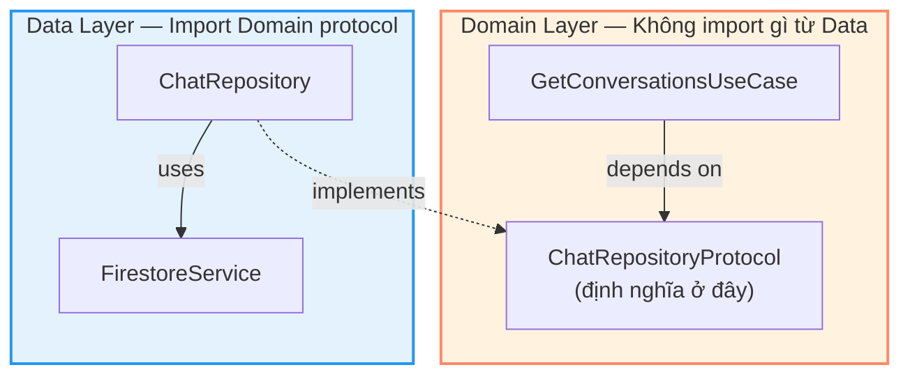
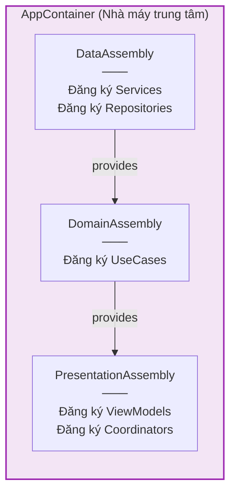
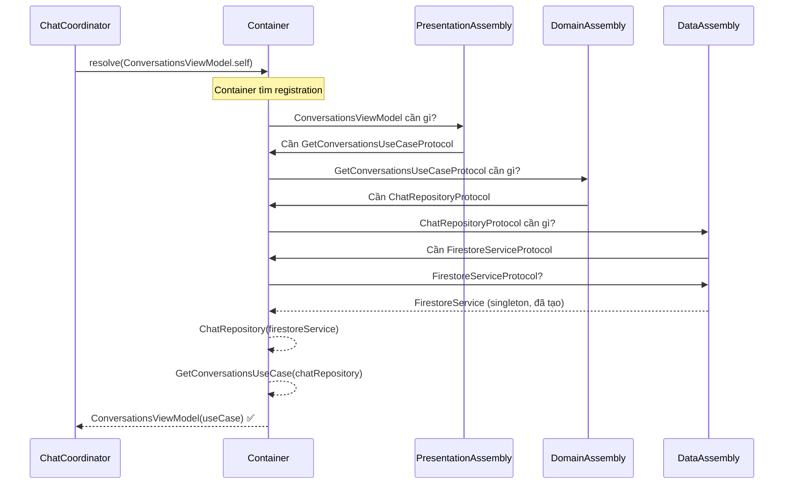

# Dependency Injection & Dependency Inversion Deep Dive

> Hai khái niệm tên giống nhau nhưng khác hoàn toàn — giải thích qua VietMatch

---

## 1. Phân Biệt Hai Khái Niệm

Nhiều người nhầm lẫn **Dependency Injection (DI)** và **Dependency Inversion Principle (DIP)** vì tên giống nhau. Thực tế chúng giải quyết **hai vấn đề khác nhau**:

| | Dependency Injection (DI) | Dependency Inversion Principle (DIP) |
|---|---|---|
| **Là gì** | Kỹ thuật (technique) | Nguyên tắc thiết kế (design principle) |
| **Giải quyết** | *Ai tạo* dependencies? | *Ai phụ thuộc vào ai?* |
| **Câu hỏi** | "ViewModel lấy UseCase ở đâu?" | "Repository nên phụ thuộc Domain hay ngược lại?" |
| **Thuộc về** | SOLID — không thuộc chữ nào cụ thể | SOLID — chữ **D** (Dependency Inversion) |
| **Có thể dùng riêng** | Có DI mà không có DIP | Có DIP mà không có DI |

**Ví von:**
- **DIP** = Quy tắc "không gọi cho tôi, tôi sẽ gọi cho bạn" (Hollywood Principle)
- **DI** = Dịch vụ ship đồ ăn tận nhà (thay vì bạn tự đi chợ nấu)

---

## 2. Dependency Inversion Principle (DIP)

### Vấn đề: Phụ thuộc sai hướng

Bình thường, code phụ thuộc theo hướng "từ trên xuống":

```
❌ Phụ thuộc truyền thống (sai hướng):

Domain Layer
└── GetConversationsUseCase
    └── import ChatRepository        ← Domain biết Data layer
        └── import FirestoreService  ← biết cả Firebase
```

Vấn đề: Nếu đổi Firebase sang Supabase, phải sửa cả UseCase trong Domain — **vi phạm nguyên tắc "domain không biết infra"**.

### Giải pháp: Đảo ngược dependency

```
✅ Dependency Inversion (đúng hướng):

Domain Layer (KHÔNG biết Data Layer tồn tại)
├── GetConversationsUseCase
│   └── depends on: ChatRepositoryProtocol  ← Chỉ biết protocol
│
└── ChatRepositoryProtocol                   ← Protocol ĐỊNH NGHĨA ở Domain
    (protocol definition)

Data Layer (PHỤ THUỘC vào Domain)
└── ChatRepository: ChatRepositoryProtocol   ← Data implements Domain's protocol
    └── import FirestoreService
```

### Trong VietMatch



**Code thực tế:**

```swift
// ──── DOMAIN LAYER ────

// Domain/Repositories/ChatRepositoryProtocol.swift
// Protocol ĐỊNH NGHĨA trong Domain — Domain quyết định "tôi cần gì"
protocol ChatRepositoryProtocol {
    func sendMessage(matchId: String, senderId: String,
                     content: String, type: MessageType) async throws -> Message
    func getMessages(matchId: String, limit: Int, before: Date?) async throws -> [Message]
    func observeMessages(matchId: String) -> AnyPublisher<[Message], Error>
    func getConversations(userId: String) async throws -> [Conversation]
    func observeConversations(userId: String) -> AnyPublisher<[Conversation], Error>
    func markAsRead(matchId: String, userId: String) async throws
}

// Domain/UseCases/Chat/GetConversationsUseCase.swift
// UseCase CHỈ BIẾT protocol — không biết Firebase, Firestore, hay bất kỳ infra nào
final class GetConversationsUseCase: GetConversationsUseCaseProtocol {
    private let chatRepository: ChatRepositoryProtocol  // ← Protocol type

    init(chatRepository: ChatRepositoryProtocol) {
        self.chatRepository = chatRepository
    }

    func execute(userId: String) async throws -> [Conversation] {
        try await chatRepository.getConversations(userId: userId)
    }
}

// ──── DATA LAYER ────

// Data/Repositories/ChatRepository.swift
// Data layer IMPLEMENTS Domain's protocol — Data phụ thuộc vào Domain
final class ChatRepository: ChatRepositoryProtocol {  // ← Conform Domain protocol
    private let firestoreService: FirestoreServiceProtocol

    func getConversations(userId: String) async throws -> [Conversation] {
        // Chi tiết Firebase ở đây — Domain không biết
        let matchDTOs: [MatchDTO] = try await firestoreService.getDocuments(
            collection: "matches",
            filters: [.init(field: "user_id", op: .isEqualTo, value: userId)]
        )
        return matchDTOs.map { $0.toDomain() }
    }
}
```

### Hướng dependency trước và sau DIP

```
❌ TRƯỚC DIP (hướng truyền thống):
Domain → Data → Firebase
(High-level phụ thuộc Low-level)

✅ SAU DIP (đảo ngược):
Domain ← Data → Firebase
  ↑        ↑
  │        └── Data implements Domain's protocol
  └── Domain chỉ biết protocol, không biết Data
```

### Tại sao quan trọng?

| Tình huống | Không có DIP | Có DIP |
|-----------|-------------|--------|
| Đổi Firebase → Supabase | Sửa UseCase + Repository + Tests | Chỉ sửa Repository |
| Test UseCase | Cần mock Firebase | Chỉ mock protocol |
| Thêm cache layer | Sửa UseCase | Tạo CachedRepository implements protocol |
| Domain logic thay đổi | Ảnh hưởng Data layer | Chỉ ảnh hưởng Domain |

---

## 3. Dependency Injection (DI)

### Vấn đề: Dependencies tạo ở đâu?

```swift
// ❌ KHÔNG có DI — tự tạo dependencies
final class ConversationsViewModel: ObservableObject {
    private let useCase = GetConversationsUseCase(
        chatRepository: ChatRepository(
            firestoreService: FirestoreService()  // ← Hardcoded cả chuỗi
        )
    )
}
```

Vấn đề:
- ViewModel **biết** cách tạo UseCase, Repository, FirestoreService
- **Không thể** thay thế bằng mock khi test
- **Tightly coupled** — đổi constructor Repository = sửa ViewModel

### Giải pháp: Inject từ bên ngoài

```swift
// ✅ CÓ DI — nhận dependencies từ bên ngoài
final class ConversationsViewModel: ObservableObject {
    private let useCase: GetConversationsUseCaseProtocol  // ← Chỉ biết protocol

    init(getConversationsUseCase: GetConversationsUseCaseProtocol) {
        self.useCase = getConversationsUseCase  // ← Ai đó truyền vào
    }
}
```

### 3 Cách Inject

```swift
// 1. CONSTRUCTOR INJECTION (VietMatch dùng cách này) ✅
// Dependencies truyền qua init — rõ ràng, bắt buộc
final class LoginViewModel: ObservableObject {
    private let loginUseCase: LoginUseCaseProtocol

    init(loginUseCase: LoginUseCaseProtocol) {
        self.loginUseCase = loginUseCase
    }
}

// 2. PROPERTY INJECTION
// Dependencies gán qua property — linh hoạt nhưng có thể quên
final class LoginViewModel: ObservableObject {
    var loginUseCase: LoginUseCaseProtocol!  // ← Có thể nil nếu quên set
}

// 3. METHOD INJECTION
// Dependencies truyền qua method parameter — cho từng lần gọi
func login(using useCase: LoginUseCaseProtocol) async { ... }
```

**VietMatch chọn Constructor Injection** vì:
- Dependencies **bắt buộc** — compiler báo lỗi nếu thiếu
- **Immutable** — không thể thay đổi sau init
- **Rõ ràng** — nhìn init là biết class cần gì

---

## 4. Swinject — DI Container Trong VietMatch

### DI Container là gì?

Hãy tưởng tượng DI Container như một **nhà máy trung tâm**. Thay vì mỗi class tự lo tạo dependencies, tất cả được đăng ký tại một nơi:



### AppContainer — Điểm trung tâm

```swift
// App/DI/AppContainer.swift
final class AppContainer {
    static let shared = AppContainer()         // Singleton
    private let container = Container()

    private init() {
        DataAssembly().assemble(container: container)
        DomainAssembly().assemble(container: container)
        PresentationAssembly().assemble(container: container)
    }

    func resolve<T>(_ type: T.Type) -> T {
        guard let resolved = container.resolve(type) else {
            fatalError("Failed to resolve \(type)")  // Crash nếu quên đăng ký
        }
        return resolved
    }
}
```

### DataAssembly — Đăng ký tầng dữ liệu

```swift
// App/DI/DataAssembly.swift
final class DataAssembly: Assembly {
    func assemble(container: Container) {

        // ── Services (Singleton — chỉ tạo 1 instance) ──
        container.register(FirebaseAuthServiceProtocol.self) { _ in
            FirebaseAuthService()
        }.inObjectScope(.container)  // ← Singleton

        container.register(FirestoreServiceProtocol.self) { _ in
            FirestoreService()
        }.inObjectScope(.container)

        container.register(FirebaseStorageServiceProtocol.self) { _ in
            FirebaseStorageService()
        }.inObjectScope(.container)

        container.register(FCMServiceProtocol.self) { _ in
            FCMService()
        }.inObjectScope(.container)

        container.register(UserDefaultsServiceProtocol.self) { _ in
            UserDefaultsService()
        }.inObjectScope(.container)

        // ── Repositories (Singleton — dùng chung services) ──
        container.register(AuthRepositoryProtocol.self) { r in
            AuthRepository(
                authService: r.resolve(FirebaseAuthServiceProtocol.self)!,
                firestoreService: r.resolve(FirestoreServiceProtocol.self)!,
                userDefaultsService: r.resolve(UserDefaultsServiceProtocol.self)!
            )
        }.inObjectScope(.container)

        container.register(ChatRepositoryProtocol.self) { r in
            ChatRepository(
                firestoreService: r.resolve(FirestoreServiceProtocol.self)!
            )
        }.inObjectScope(.container)

        // ProfileRepository, MatchRepository... tương tự
    }
}
```

### DomainAssembly — Đăng ký tầng business logic

```swift
// App/DI/DomainAssembly.swift
final class DomainAssembly: Assembly {
    func assemble(container: Container) {

        // ── Auth UseCases ──
        container.register(LoginUseCaseProtocol.self) { r in
            LoginUseCase(
                authRepository: r.resolve(AuthRepositoryProtocol.self)!
                //              ↑ Resolve protocol, không biết concrete type
            )
        }

        container.register(RegisterUseCaseProtocol.self) { r in
            RegisterUseCase(
                authRepository: r.resolve(AuthRepositoryProtocol.self)!
            )
        }

        // ── Chat UseCases ──
        container.register(GetConversationsUseCaseProtocol.self) { r in
            GetConversationsUseCase(
                chatRepository: r.resolve(ChatRepositoryProtocol.self)!
            )
        }

        container.register(SendMessageUseCaseProtocol.self) { r in
            SendMessageUseCase(
                chatRepository: r.resolve(ChatRepositoryProtocol.self)!
            )
        }

        // ... 12 use cases tổng cộng
    }
}
```

### PresentationAssembly — Đăng ký tầng UI

```swift
// App/DI/PresentationAssembly.swift
final class PresentationAssembly: Assembly {
    func assemble(container: Container) {

        // ── AppCoordinator (Singleton) ──
        container.register(AppCoordinator.self) { r in
            AppCoordinator(container: r as! Container)
        }.inObjectScope(.container)

        // ── ViewModels (Transient — tạo mới mỗi lần resolve) ──
        container.register(LoginViewModel.self) { r in
            MainActor.assumeIsolated {
                LoginViewModel(
                    loginUseCase: r.resolve(LoginUseCaseProtocol.self)!
                )
            }
        }

        container.register(DiscoverViewModel.self) { r in
            MainActor.assumeIsolated {
                DiscoverViewModel(
                    getDiscoverProfilesUseCase: r.resolve(GetDiscoverProfilesUseCaseProtocol.self)!,
                    swipeUseCase: r.resolve(SwipeUseCaseProtocol.self)!
                )
            }
        }

        // ── ChatViewModel với argument (Factory pattern) ──
        container.register(ChatViewModel.self) { (r, matchId: String) in
            MainActor.assumeIsolated {
                ChatViewModel(
                    getMessagesUseCase: r.resolve(GetMessagesUseCaseProtocol.self)!,
                    sendMessageUseCase: r.resolve(SendMessageUseCaseProtocol.self)!,
                    matchId: matchId  // ← Runtime argument
                )
            }
        }
    }
}
```

---

## 5. Object Scope — Singleton vs Transient

Swinject cho phép kiểm soát **bao nhiêu instance** được tạo:

| Scope | Ý nghĩa | Dùng cho | VietMatch |
|-------|---------|---------|-----------|
| `.container` | Singleton — 1 instance duy nhất | Services, Repositories | FirestoreService, ChatRepository |
| Default (transient) | Tạo mới mỗi lần resolve | ViewModels, UseCases | LoginViewModel, SwipeUseCase |

```swift
// Singleton — gọi 100 lần vẫn cùng 1 instance
container.register(FirestoreServiceProtocol.self) { _ in
    FirestoreService()
}.inObjectScope(.container)

let a = container.resolve(FirestoreServiceProtocol.self)!
let b = container.resolve(FirestoreServiceProtocol.self)!
// a === b  ← cùng 1 object

// Transient — mỗi lần resolve tạo instance mới
container.register(LoginViewModel.self) { r in
    LoginViewModel(loginUseCase: r.resolve(LoginUseCaseProtocol.self)!)
}

let vm1 = container.resolve(LoginViewModel.self)!
let vm2 = container.resolve(LoginViewModel.self)!
// vm1 !== vm2  ← 2 object khác nhau
```

**Tại sao Services là Singleton?** Firebase SDK quản lý connection pool nội bộ — tạo nhiều instance gây lãng phí tài nguyên.

**Tại sao ViewModels là Transient?** Mỗi screen cần state riêng — 2 LoginView cần 2 LoginViewModel độc lập.

---

## 6. Chuỗi Dependency Hoàn Chỉnh

Khi `ChatCoordinator` cần tạo `ConversationsView`, chuỗi resolve diễn ra:



**Toàn bộ chuỗi diễn ra tự động** — Coordinator chỉ cần 1 dòng:

```swift
let viewModel = container.resolve(ConversationsViewModel.self)!
```

Container tự biết cần resolve gì → resolve tiếp → resolve tiếp → cho đến khi đủ.

---

## 7. Sơ Đồ Toàn Bộ Dependencies

```mermaid
graph TD
    subgraph Presentation ["Presentation Layer"]
        AppCoord["AppCoordinator"]
        LoginVM["LoginViewModel"]
        RegisterVM["RegisterViewModel"]
        OnboardVM["OnboardingViewModel"]
        DiscoverVM["DiscoverViewModel"]
        MatchesVM["MatchesViewModel"]
        ConvoVM["ConversationsViewModel"]
        ChatVM["ChatViewModel"]
        ProfileVM["ProfileViewModel"]
        SettingsVM["SettingsViewModel"]
    end

    subgraph Domain ["Domain Layer (UseCases)"]
        LoginUC["LoginUseCase"]
        RegisterUC["RegisterUseCase"]
        LogoutUC["LogoutUseCase"]
        GetProfileUC["GetProfileUseCase"]
        UpdateProfileUC["UpdateProfileUseCase"]
        UploadPhotoUC["UploadPhotoUseCase"]
        SwipeUC["SwipeUseCase"]
        GetMatchesUC["GetMatchesUseCase"]
        GetDiscoverUC["GetDiscoverProfilesUseCase"]
        SendMsgUC["SendMessageUseCase"]
        GetMsgUC["GetMessagesUseCase"]
        GetConvoUC["GetConversationsUseCase"]
    end

    subgraph Data ["Data Layer"]
        AuthRepo["AuthRepository"]
        ProfileRepo["ProfileRepository"]
        MatchRepo["MatchRepository"]
        ChatRepo["ChatRepository"]
        AuthSvc["FirebaseAuthService"]
        FirestoreSvc["FirestoreService"]
        StorageSvc["FirebaseStorageService"]
        FCMSvc["FCMService"]
        UDSvc["UserDefaultsService"]
    end

    LoginVM --> LoginUC
    RegisterVM --> RegisterUC
    OnboardVM --> UpdateProfileUC
    OnboardVM --> UploadPhotoUC
    DiscoverVM --> GetDiscoverUC
    DiscoverVM --> SwipeUC
    MatchesVM --> GetMatchesUC
    ConvoVM --> GetConvoUC
    ChatVM --> GetMsgUC
    ChatVM --> SendMsgUC
    ProfileVM --> GetProfileUC
    ProfileVM --> UpdateProfileUC
    ProfileVM --> LogoutUC
    SettingsVM --> LogoutUC

    LoginUC --> AuthRepo
    RegisterUC --> AuthRepo
    LogoutUC --> AuthRepo
    GetProfileUC --> ProfileRepo
    UpdateProfileUC --> ProfileRepo
    UploadPhotoUC --> ProfileRepo
    SwipeUC --> MatchRepo
    GetMatchesUC --> MatchRepo
    GetDiscoverUC --> MatchRepo
    SendMsgUC --> ChatRepo
    GetMsgUC --> ChatRepo
    GetConvoUC --> ChatRepo

    AuthRepo --> AuthSvc
    AuthRepo --> FirestoreSvc
    AuthRepo --> UDSvc
    ProfileRepo --> FirestoreSvc
    ProfileRepo --> StorageSvc
    MatchRepo --> FirestoreSvc
    ChatRepo --> FirestoreSvc

    style Presentation fill:#FFE0E6,stroke:#FE3C72
    style Domain fill:#FFF3E0,stroke:#FF8A65
    style Data fill:#E3F2FD,stroke:#2196F3
```



---

## 8. DI + DIP Kết Hợp — Sức Mạnh Thực Sự

DI và DIP kết hợp tạo ra hệ thống **linh hoạt** và **dễ test**:

### Đổi Backend (nhờ DIP)

```swift
// Đổi Firebase → Supabase — CHỈ SỬA DataAssembly
container.register(ChatRepositoryProtocol.self) { r in
    // ChatRepository(firestoreService: ...)     ← Trước
    SupabaseChatRepository(client: supabaseClient) // ← Sau
}.inObjectScope(.container)

// Domain và Presentation KHÔNG THAY ĐỔI GÌ ✅
```

### Test (nhờ DI)

```swift
// Test ViewModel — inject mock UseCase
func test_loadConversations() async {
    let mockUseCase = MockGetConversationsUseCase()
    mockUseCase.result = [mockConversation]

    let viewModel = ConversationsViewModel(
        getConversationsUseCase: mockUseCase  // ← Inject mock
    )

    await viewModel.loadConversations(userId: "user1")
    XCTAssertEqual(viewModel.conversations.count, 1)
}
```

### Thêm Cache Layer (nhờ DIP)

```swift
// Thêm cache mà không sửa UseCase hay ViewModel
final class CachedChatRepository: ChatRepositoryProtocol {
    private let remote: ChatRepositoryProtocol
    private var cache: [Conversation] = []

    func getConversations(userId: String) async throws -> [Conversation] {
        if !cache.isEmpty { return cache }
        cache = try await remote.getConversations(userId: userId)
        return cache
    }
}

// Đăng ký trong DataAssembly — Decorator pattern
container.register(ChatRepositoryProtocol.self) { r in
    CachedChatRepository(
        remote: ChatRepository(firestoreService: r.resolve(FirestoreServiceProtocol.self)!)
    )
}.inObjectScope(.container)
```

---

## 9. Anti-Patterns — Những Điều Cần Tránh

### ❌ Service Locator (giống DI nhưng không phải)

```swift
// ❌ Service Locator — class tự resolve
class BadViewModel: ObservableObject {
    private let useCase = AppContainer.shared.resolve(LoginUseCaseProtocol.self)
    //                    ↑ Class tự tìm dependency → hidden dependency
}

// ✅ Dependency Injection — class nhận từ bên ngoài
class GoodViewModel: ObservableObject {
    private let useCase: LoginUseCaseProtocol

    init(useCase: LoginUseCaseProtocol) {
        self.useCase = useCase  // ← Rõ ràng, nhìn init biết cần gì
    }
}
```

### ❌ Concrete type thay vì Protocol

```swift
// ❌ Phụ thuộc concrete type
class BadUseCase {
    private let repo: ChatRepository  // ← Biết concrete type → khó test, khó đổi
}

// ✅ Phụ thuộc protocol
class GoodUseCase {
    private let repo: ChatRepositoryProtocol  // ← Chỉ biết interface
}
```

### ❌ God Container — resolve trực tiếp trong View

```swift
// ❌ View tự resolve — View biết quá nhiều
struct BadView: View {
    let viewModel = AppContainer.shared.resolve(LoginViewModel.self)
}

// ✅ Coordinator inject — View không biết Container
struct GoodView: View {
    @ObservedObject var viewModel: LoginViewModel  // ← Được truyền vào
}
```

---

## 10. Tóm Tắt

```
DIP (Nguyên tắc):
  "High-level modules không phụ thuộc low-level modules.
   Cả hai phụ thuộc vào abstractions (protocols)."

  Domain ← Data    (Data implements Domain's protocols)
  Domain KHÔNG biết Firebase, Firestore, hay bất kỳ infra nào

DI (Kỹ thuật):
  "Đừng tự tạo dependencies. Nhận chúng từ bên ngoài."

  Swinject Container tạo tất cả → inject qua init → mỗi class chỉ biết protocols

Kết hợp:
  DIP quyết định HƯỚNG dependency (ai phụ thuộc ai)
  DI quyết định AI TẠO dependency (Container tạo, không phải class)
```

| Câu hỏi | DIP trả lời | DI trả lời |
|---------|-------------|-------------|
| ViewModel cần UseCase? | ViewModel phụ thuộc UseCase **protocol** | Container **inject** UseCase vào ViewModel |
| UseCase cần Repository? | UseCase phụ thuộc Repository **protocol** | Container **inject** Repository vào UseCase |
| Đổi Firebase? | Chỉ sửa Data layer — Domain không đổi | Chỉ sửa Container registration |
| Test ViewModel? | Mock UseCase protocol | Inject mock qua init |
