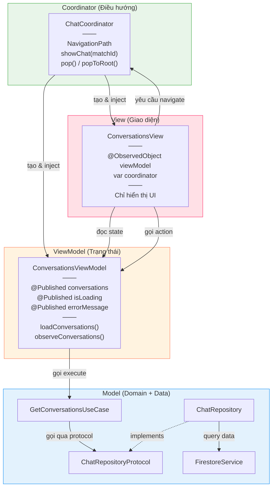
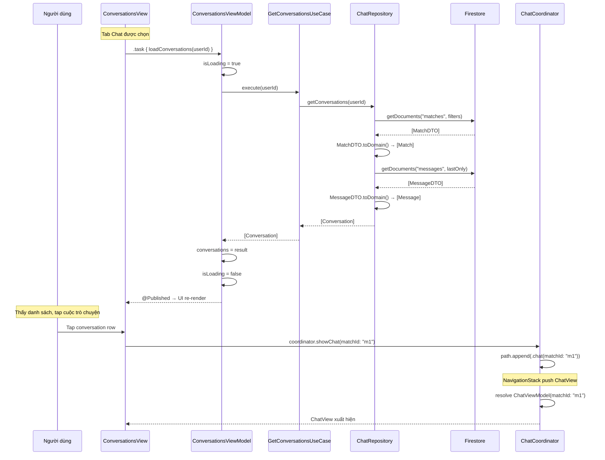
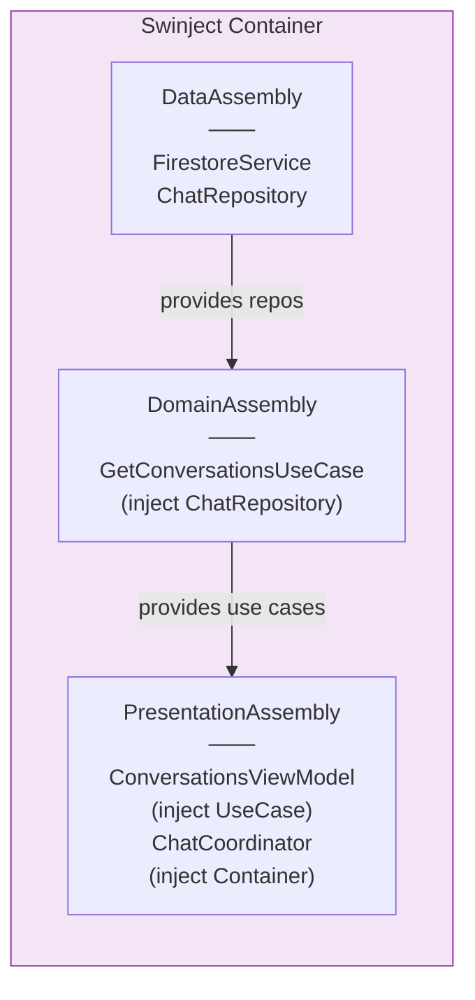

# MVVM-C Deep Dive

> Giải thích chi tiết pattern MVVM-C trong VietMatch, từ lý thuyết đến thực hành

---

## 1. MVVM-C Là Gì?

**MVVM-C** = **Model - View - ViewModel - Coordinator**

Hãy tưởng tượng một nhà hàng:

| Vai trò nhà hàng | MVVM-C | Trách nhiệm |
|------------------|--------|-------------|
| **Thực đơn & nguyên liệu** | Model | Dữ liệu và business logic |
| **Bàn ăn & bát đĩa** | View | Giao diện người dùng nhìn thấy |
| **Bồi bàn** | ViewModel | Nhận order từ khách, giao cho bếp, mang đồ ăn ra |
| **Quản lý nhà hàng** | Coordinator | Dẫn khách đến bàn nào, chuyển phòng khi cần |

Mỗi người có **một việc duy nhất**, không ai xen vào việc của người khác.

---

## 2. Tại Sao Không Dùng MVC Như Apple Gợi Ý?

MVC (Model-View-Controller) của Apple thường dẫn đến **Massive View Controller** — Controller làm quá nhiều việc:

```
MVC truyền thống:
┌──────────────────────────────────┐
│         ViewController           │  ← "Massive View Controller"
│  - UI logic                      │
│  - Business logic                │
│  - Navigation                    │
│  - Data fetching                 │
│  - Data formatting               │
│  - Error handling                │
│  - 2000+ dòng code...           │
└──────────────────────────────────┘

MVVM-C chia nhỏ:
┌──────────┐ ┌───────────┐ ┌───────┐ ┌─────────────┐
│   View   │ │ ViewModel │ │ Model │ │ Coordinator │
│  UI only │ │  state +  │ │ data  │ │ navigation  │
│  ~100 LOC│ │  logic    │ │       │ │             │
└──────────┘ └───────────┘ └───────┘ └─────────────┘
```

---

## 3. Kiến Trúc Tổng Quan



---

## 4. Từng Layer Chi Tiết

### 4.1 Model — "Bếp trưởng và kho nguyên liệu"

Model trong MVVM-C của VietMatch gồm 3 tầng con (Clean Architecture):

```
┌─────────────────────────────────────────┐
│  Domain Layer (Business Rules)          │
│  ┌───────────┐  ┌───────────────────┐   │
│  │ Entities  │  │ Repository        │   │
│  │ (structs) │  │ Protocols         │   │
│  └───────────┘  └───────────────────┘   │
│  ┌──────────────────────────────────┐   │
│  │ UseCases (business logic)        │   │
│  └──────────────────────────────────┘   │
├─────────────────────────────────────────┤
│  Data Layer (Implementations)           │
│  ┌──────────────┐  ┌────────────────┐   │
│  │ Repositories │  │ DTOs + Mappers │   │
│  │ (concrete)   │  │ (Codable)      │   │
│  └──────────────┘  └────────────────┘   │
│  ┌──────────────────────────────────┐   │
│  │ Firebase Services (data source)  │   │
│  └──────────────────────────────────┘   │
└─────────────────────────────────────────┘
```

**Ví dụ thực tế — Entity:**

```swift
// Domain/Entities/Message.swift
struct Conversation {
    let id: String
    let match: Match
    let lastMessage: Message?
    let unreadCount: Int
}
```

**Ví dụ thực tế — UseCase:**

```swift
// Domain/UseCases/Chat/GetConversationsUseCase.swift
protocol GetConversationsUseCaseProtocol {
    func execute(userId: String) async throws -> [Conversation]
    func observe(userId: String) -> AnyPublisher<[Conversation], Error>
}

final class GetConversationsUseCase: GetConversationsUseCaseProtocol {
    private let chatRepository: ChatRepositoryProtocol  // ← Protocol, không phải concrete

    init(chatRepository: ChatRepositoryProtocol) {
        self.chatRepository = chatRepository
    }

    func execute(userId: String) async throws -> [Conversation] {
        try await chatRepository.getConversations(userId: userId)
    }

    func observe(userId: String) -> AnyPublisher<[Conversation], Error> {
        chatRepository.observeConversations(userId: userId)
    }
}
```

**Tại sao UseCase chỉ gọi thẳng Repository?** UseCase là nơi đặt business validation (ví dụ: `SendMessageUseCase` kiểm tra tin nhắn không rỗng). Với `GetConversations`, không cần validation nên nó chỉ forward — nhưng UseCase vẫn cần thiết vì:
- ViewModel không biết Repository tồn tại
- Dễ thêm logic sau (cache, filter, sort)
- Test ViewModel chỉ cần mock UseCase, không mock Repository

---

### 4.2 View — "Bàn ăn chỉ để trưng bày"

View trong SwiftUI **chỉ làm 2 việc**: hiển thị UI và chuyển tiếp user action.

```swift
// Presentation/Screens/Chat/ConversationsView.swift
struct ConversationsView: View {
    @ObservedObject var viewModel: ConversationsViewModel  // ← Đọc state
    var coordinator: ChatCoordinator                       // ← Yêu cầu navigate

    var body: some View {
        List {
            ForEach(viewModel.conversations) { conversation in
                Button {
                    // View KHÔNG biết navigate đi đâu
                    // Chỉ nói với Coordinator: "tôi muốn mở chat này"
                    coordinator.showChat(matchId: conversation.id)
                } label: {
                    conversationRow(conversation)
                }
            }
        }
        .task {
            // Trigger load — View không biết data từ đâu
            await viewModel.loadConversations(userId: "currentUser")
        }
    }
}
```

**Quy tắc vàng của View:**

| Được phép | Không được phép |
|----------|----------------|
| Đọc `viewModel.conversations` | Gọi `repository.getConversations()` |
| Gọi `viewModel.loadConversations()` | Tự fetch data từ Firebase |
| Gọi `coordinator.showChat()` | Tự push NavigationStack |
| Hiển thị `viewModel.isLoading` | Tự quản lý loading state |

---

### 4.3 ViewModel — "Bồi bàn thông minh"

ViewModel là cầu nối giữa View và Model. Nó:
- Giữ **state** (`@Published`)
- Xử lý **user actions** (gọi UseCase)
- **Format data** cho View hiển thị

```swift
// Presentation/Screens/Chat/ConversationsViewModel.swift
@MainActor                                          // ← Đảm bảo update UI trên main thread
final class ConversationsViewModel: ObservableObject {
    @Published var conversations: [Conversation] = []  // ← View đọc
    @Published var isLoading = false                   // ← View hiển thị spinner
    @Published var errorMessage: String?               // ← View hiển thị alert

    private let getConversationsUseCase: GetConversationsUseCaseProtocol
    private var cancellables = Set<AnyCancellable>()

    init(getConversationsUseCase: GetConversationsUseCaseProtocol) {
        self.getConversationsUseCase = getConversationsUseCase  // ← Inject UseCase
    }

    // Pattern 1: Async/await cho one-time load
    func loadConversations(userId: String) async {
        isLoading = true
        do {
            conversations = try await getConversationsUseCase.execute(userId: userId)
        } catch {
            errorMessage = error.localizedDescription
        }
        isLoading = false
    }

    // Pattern 2: Combine cho real-time updates
    func observeConversations(userId: String) {
        getConversationsUseCase.observe(userId: userId)
            .receive(on: DispatchQueue.main)
            .sink { [weak self] completion in
                if case .failure(let error) = completion {
                    self?.errorMessage = error.localizedDescription
                }
            } receiveValue: { [weak self] conversations in
                self?.conversations = conversations
            }
            .store(in: &cancellables)
    }
}
```

**ViewModel KHÔNG biết:**
- View trông như thế nào (không import SwiftUI views)
- Dữ liệu đến từ Firebase hay mock (chỉ biết UseCase protocol)
- Coordinator navigate đi đâu (không giữ reference đến Coordinator)

---

### 4.4 Coordinator — "Quản lý nhà hàng"

Coordinator quản lý **navigation** và **tạo dependencies**:

```swift
// Presentation/Navigation/ChatCoordinator.swift
final class ChatCoordinator: Coordinator {
    @Published var path = NavigationPath()    // ← Navigation state
    private let container: Container          // ← DI container

    // NAVIGATION METHODS — View gọi khi cần chuyển màn hình
    func showChat(matchId: String) {
        path.append(ChatRoute.chat(matchId: matchId))  // ← Push
    }
    // pop() và popToRoot() kế thừa từ Coordinator protocol

    // FACTORY METHODS — Tạo View + ViewModel
    func conversationsView() -> some View {
        let viewModel = container.resolve(ConversationsViewModel.self)!
        return ConversationsView(viewModel: viewModel, coordinator: self)
        //                       ↑ inject ViewModel    ↑ inject chính mình
    }

    func chatView(matchId: String) -> some View {
        let viewModel = container.resolve(ChatViewModel.self, argument: matchId)!
        return ChatView(viewModel: viewModel)
        //              ↑ inject ViewModel với argument
    }
}
```

**Coordinator chịu trách nhiệm:**
1. Tạo ViewModel (resolve từ Swinject)
2. Tạo View (inject ViewModel + chính mình)
3. Quản lý NavigationPath (push/pop/popToRoot)
4. Route → View mapping (ChatRoute enum → destination view)

---

## 5. Luồng Dữ Liệu Hoàn Chỉnh

Lấy ví dụ: **Người dùng mở tab Chat và tap vào một cuộc trò chuyện**



---

## 6. Dependency Injection — Keo Dán Các Layer

Swinject Container đóng vai trò "nhà máy" tạo ra tất cả dependencies:



```swift
// DomainAssembly.swift — đăng ký UseCase
container.register(GetConversationsUseCaseProtocol.self) { r in
    GetConversationsUseCase(
        chatRepository: r.resolve(ChatRepositoryProtocol.self)!
        //              ↑ Inject repository protocol
    )
}

// PresentationAssembly.swift — đăng ký ViewModel
container.register(ConversationsViewModel.self) { r in
    ConversationsViewModel(
        getConversationsUseCase: r.resolve(GetConversationsUseCaseProtocol.self)!
        //                      ↑ Inject use case protocol
    )
}
```

**Chuỗi dependency:**

```
View ← ViewModel ← UseCase ← Repository(Protocol) ← FirestoreService
                                    ↑
                          Repository(Concrete) implements
```

Mũi tên `←` nghĩa là "được inject vào". Không layer nào tự tạo dependency của mình.

---

## 7. So Sánh MVVM vs MVVM-C

| Tiêu chí | MVVM | MVVM-C |
|----------|------|--------|
| Navigation | ViewModel hoặc View xử lý | **Coordinator xử lý** |
| View tạo ViewModel | View tự tạo hoặc inject | **Coordinator tạo và inject** |
| Deep linking | Khó implement | Dễ — Coordinator quản lý routes |
| Testability | ViewModel testable, navigation khó test | **Tất cả testable** |
| Reusability | View gắn chặt với navigation | View tái sử dụng — không biết navigate đi đâu |

### Ví dụ sự khác biệt

```swift
// ❌ MVVM thuần — View tự navigate
struct ConversationsView: View {
    @StateObject var viewModel = ConversationsViewModel()

    var body: some View {
        NavigationLink(destination: ChatView(matchId: id)) {  // ← View biết đích
            conversationRow(conversation)
        }
    }
}

// ✅ MVVM-C — View ủy quyền cho Coordinator
struct ConversationsView: View {
    @ObservedObject var viewModel: ConversationsViewModel  // ← Được inject
    var coordinator: ChatCoordinator                       // ← Được inject

    var body: some View {
        Button {
            coordinator.showChat(matchId: id)  // ← Không biết đích, chỉ yêu cầu
        } label: {
            conversationRow(conversation)
        }
    }
}
```

---

## 8. Testing — Lợi Ích Lớn Nhất Của MVVM-C

Mỗi layer có thể test **độc lập** nhờ protocol-based design:

```swift
// Test ViewModel — không cần Firebase, không cần UI
class ConversationsViewModelTests: XCTestCase {
    func test_loadConversations_success() async {
        // 1. Tạo mock
        let mockUseCase = MockGetConversationsUseCase()
        mockUseCase.result = [conversation1, conversation2]

        // 2. Inject mock vào ViewModel
        let viewModel = ConversationsViewModel(getConversationsUseCase: mockUseCase)

        // 3. Test
        await viewModel.loadConversations(userId: "user1")
        XCTAssertEqual(viewModel.conversations.count, 2)
        XCTAssertFalse(viewModel.isLoading)
    }
}
```

**Giao diện mock tại mỗi layer:**

```
Layer cần test     Mock cái gì           Không cần
──────────────     ────────────           ──────────
ViewModel          Mock UseCase           Firebase, UI
UseCase            Mock Repository        Firebase, ViewModel
Repository         Mock FirestoreService  Firestore server
Coordinator        Mock Container         Tất cả services
View               Mock ViewModel +       Business logic
                   Mock Coordinator
```

---

## 9. Khi Nào MVVM-C Hợp Lý, Khi Nào Không?

### Nên dùng khi

- App có **nhiều màn hình** và navigation phức tạp
- Cần **deep linking** (push notification → màn hình cụ thể)
- Team **nhiều người** — mỗi người làm một layer
- Cần **test coverage** cao
- App sẽ **phát triển lâu dài**

### Có thể quá mức khi

- App chỉ có **1-3 màn hình**
- **Prototype** nhanh, không cần test
- **Solo developer** với deadline gấp

---

## 10. Tóm Tắt Nhanh

```
View        → "Tôi chỉ hiển thị, không biết data từ đâu"
ViewModel   → "Tôi giữ state và gọi UseCase, không biết View trông ra sao"
Model       → "Tôi xử lý data và business logic, không biết ai dùng tôi"
Coordinator → "Tôi quyết định đi đâu và tạo mọi thứ cần thiết"
```

| Ai tạo ai? | Câu trả lời |
|-----------|-------------|
| Ai tạo View? | Coordinator |
| Ai tạo ViewModel? | Coordinator (resolve từ Swinject) |
| Ai tạo UseCase? | Swinject Container |
| Ai tạo Repository? | Swinject Container |
| Ai tạo Coordinator? | Parent Coordinator |
