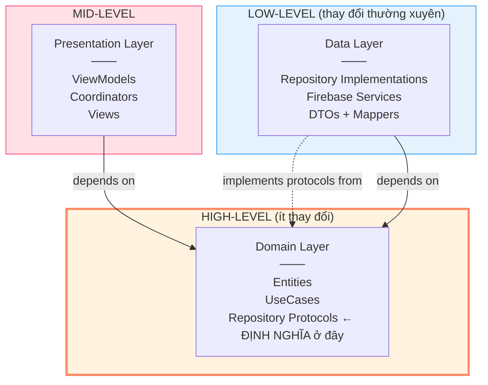
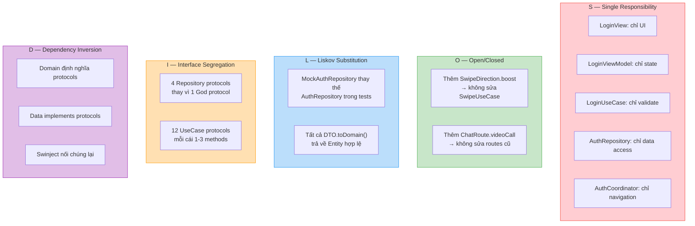

# Kiến Thức: SOLID Principles Deep Dive

> 5 nguyên tắc thiết kế hướng đối tượng — giải thích qua code thực tế VietMatch

---

## SOLID Là Gì?

SOLID là 5 nguyên tắc giúp code **dễ bảo trì, dễ mở rộng, dễ test**. Tưởng tượng như 5 quy tắc xây nhà — không tuân thủ thì nhà vẫn đứng được, nhưng khi cần sửa chữa hoặc xây thêm tầng sẽ rất khổ.

| Chữ | Nguyên tắc | Một câu tóm tắt |
|-----|-----------|-----------------|
| **S** | Single Responsibility | Mỗi class chỉ có **1 lý do để thay đổi** |
| **O** | Open/Closed | Mở để **mở rộng**, đóng để **sửa đổi** |
| **L** | Liskov Substitution | Thay thế class cha bằng class con mà **không hỏng** |
| **I** | Interface Segregation | Đừng ép class implement interface **không dùng đến** |
| **D** | Dependency Inversion | High-level không phụ thuộc low-level, **cả hai phụ thuộc abstraction** |

---

## S — Single Responsibility Principle (SRP)

> *"Một class chỉ nên có một lý do để thay đổi"*

### Ví von

Một đầu bếp chỉ nên nấu ăn. Nếu bắt đầu bếp kiêm bồi bàn, thu ngân, rửa bát — khi nhà hàng thay đổi quy trình thu ngân, phải sửa cả code đầu bếp.

### Trong VietMatch

```swift
// ❌ VI PHẠM SRP — ViewModel làm quá nhiều việc
class BadLoginViewModel: ObservableObject {
    func login() async {
        // 1. Validate input          ← Business logic
        // 2. Call Firebase Auth       ← Data access
        // 3. Save token to Keychain  ← Local storage
        // 4. Navigate to home        ← Navigation
        // 5. Track analytics event   ← Analytics
    }
}

// ✅ TUÂN THỦ SRP — Mỗi class 1 trách nhiệm
class LoginViewModel: ObservableObject {      // ← Chỉ quản lý UI state
    func login() async {
        isLoading = true
        do {
            let user = try await loginUseCase.execute(email: email, password: password)
        } catch {
            errorMessage = error.localizedDescription
        }
        isLoading = false
    }
}

class LoginUseCase {                          // ← Chỉ validate & orchestrate
    func execute(email: String, password: String) async throws -> User {
        guard !email.isEmpty else { throw AuthError.invalidCredentials }
        guard !password.isEmpty else { throw AuthError.invalidCredentials }
        return try await authRepository.login(email: email, password: password)
    }
}

class AuthRepository {                        // ← Chỉ xử lý data access
    func login(email: String, password: String) async throws -> User {
        let result = try await authService.signIn(email: email, password: password)
        let dto: UserDTO = try await firestoreService.getDocument(...)
        userDefaultsService.set(value: dto.id, forKey: .currentUserId)
        return dto.toDomain()
    }
}

class AuthCoordinator {                       // ← Chỉ xử lý navigation
    func showRegister() { path.append(AuthRoute.register) }
}
```

### SRP trong kiến trúc VietMatch

| Class | Trách nhiệm duy nhất | Lý do thay đổi |
|-------|---------------------|----------------|
| `LoginView` | Hiển thị UI đăng nhập | UI design thay đổi |
| `LoginViewModel` | Quản lý state cho LoginView | State logic thay đổi |
| `LoginUseCase` | Validate và orchestrate login | Business rules thay đổi |
| `AuthRepository` | Giao tiếp Firebase Auth | Backend API thay đổi |
| `FirebaseAuthService` | Wrap Firebase Auth SDK | Firebase SDK update |
| `AuthCoordinator` | Điều hướng auth flow | Navigation flow thay đổi |
| `UserDTO` | Map data Firestore ↔ Domain | Schema Firestore thay đổi |

**Mỗi class có đúng 1 lý do để thay đổi.** Đổi UI? Sửa View. Đổi business rule? Sửa UseCase. Đổi backend? Sửa Repository. Không class nào bị ảnh hưởng bởi thay đổi không liên quan.

---

## O — Open/Closed Principle (OCP)

> *"Mở để mở rộng, đóng để sửa đổi"*

### Ví von

Ổ cắm điện **mở** để cắm bất kỳ thiết bị nào (mở rộng), nhưng bạn không cần **đục tường** mỗi lần thêm thiết bị mới (đóng để sửa đổi).

### Trong VietMatch

```swift
// ❌ VI PHẠM OCP — Phải sửa code cũ khi thêm login method mới
class BadAuthRepository {
    func login(method: String, credentials: Any) async throws -> User {
        switch method {
        case "email":    return try await loginWithEmail(credentials)
        case "google":   return try await loginWithGoogle(credentials)
        case "apple":    return try await loginWithApple(credentials)
        case "facebook": return try await loginWithFacebook(credentials)  // ← Sửa class cũ
        // Mỗi lần thêm provider mới → sửa switch này → có thể gây bug
        default: throw AuthError.unknown("Unknown method")
        }
    }
}

// ✅ TUÂN THỦ OCP — Thêm mới không cần sửa code cũ
protocol AuthRepositoryProtocol {
    func login(email: String, password: String) async throws -> User
    func loginWithGoogle() async throws -> User
    func loginWithApple(idToken: String, nonce: String) async throws -> User
}

// Thêm Facebook login? Tạo extension hoặc protocol mới
// KHÔNG SỬA AuthRepository hiện tại
extension AuthRepository {
    func loginWithFacebook(token: String) async throws -> User { ... }
}
```

**Thêm SwipeDirection mới:**

```swift
// SwipeDirection enum — MỞ để thêm case
enum SwipeDirection: String, Codable {
    case like
    case dislike
    case superLike
    // Thêm case mới dễ dàng:
    // case boost
    // case rewind
}

// SwipeUseCase — logic xử lý dựa trên direction
// Không cần sửa UseCase khi thêm direction mới
// vì Repository sẽ handle nó
func execute(swiperId: String, swipedUserId: String,
             direction: SwipeDirection) async throws -> Match? {
    try await matchRepository.swipe(
        swiperId: swiperId,
        swipedUserId: swipedUserId,
        direction: direction  // ← Forward direction, không switch
    )
}
```

**Coordinator pattern cũng tuân thủ OCP:**

```swift
// Thêm màn hình mới? Thêm route case + destination — không sửa code cũ
enum ChatRoute: Hashable {
    case conversations
    case chat(matchId: String)
    // case videoCall(matchId: String)   ← Thêm route mới
}

// Thêm destination cho route mới
func destination(for route: ChatRoute) -> some View {
    switch route {
    case .conversations: conversationsView()
    case .chat(let id): chatView(matchId: id)
    // case .videoCall(let id): videoCallView(matchId: id)  ← Thêm case
    }
}
```

---

## L — Liskov Substitution Principle (LSP)

> *"Class con phải thay thế được class cha mà không làm hỏng chương trình"*

### Ví von

Nếu bạn đặt taxi (class cha), dù xe 4 chỗ hay 7 chỗ đến (class con), bạn đều đi được đến đích. Nhưng nếu "taxi" gửi xe đạp đến — vi phạm LSP vì xe đạp không chở 4 người được.

### Trong VietMatch

```swift
// Protocol (class cha / abstraction)
protocol ChatRepositoryProtocol {
    func getMessages(matchId: String, limit: Int,
                     before: Date?) async throws -> [Message]
}

// ✅ TUÂN THỦ LSP — Implementation đáp ứng đúng contract
class ChatRepository: ChatRepositoryProtocol {
    func getMessages(matchId: String, limit: Int,
                     before: Date?) async throws -> [Message] {
        let dtos: [MessageDTO] = try await firestoreService.getDocuments(...)
        return dtos.map { $0.toDomain() }
        // Trả về [Message] đúng type, đúng logic
    }
}

// ✅ Mock cũng tuân thủ LSP — thay thế được trong tests
class MockChatRepository: ChatRepositoryProtocol {
    var getMessagesResult: Result<[Message], Error> = .success([])

    func getMessages(matchId: String, limit: Int,
                     before: Date?) async throws -> [Message] {
        try getMessagesResult.get()
        // Trả về [Message] đúng type — ViewModel không biết đang dùng mock
    }
}

// GetMessagesUseCase hoạt động đúng với CẢ HAI implementation
let useCase1 = GetMessagesUseCase(chatRepository: ChatRepository(...))    // Production
let useCase2 = GetMessagesUseCase(chatRepository: MockChatRepository())   // Test
// Cả hai đều hoạt động đúng ← LSP ✅
```

### Vi phạm LSP trông như thế nào

```swift
// ❌ VI PHẠM LSP — Mock thay đổi behavior
class BadMockChatRepository: ChatRepositoryProtocol {
    func getMessages(matchId: String, limit: Int,
                     before: Date?) async throws -> [Message] {
        fatalError("Not implemented")  // ← Crash! Không thay thế được
    }

    func sendMessage(...) async throws -> Message {
        return Message(id: "fake", content: "")  // ← Trả về data không hợp lệ
    }
}
```

### LSP qua DTO Mapping

```swift
// Tất cả DTOs đều có toDomain() trả về đúng Entity type
// → Bất kỳ DTO nào cũng thay thế được trong pipeline mapping

UserDTO().toDomain()    → User       // ✅ Luôn trả về User hợp lệ
ProfileDTO().toDomain() → Profile    // ✅ Luôn trả về Profile hợp lệ
MatchDTO().toDomain()   → Match      // ✅ Luôn trả về Match hợp lệ
MessageDTO().toDomain() → Message    // ✅ Luôn trả về Message hợp lệ
```

---

## I — Interface Segregation Principle (ISP)

> *"Đừng ép client implement interface mà nó không dùng"*

### Ví von

Remote TV có 50 nút, bạn chỉ dùng 5. ISP nói: nên có remote đơn giản 5 nút cho người dùng cơ bản, remote đầy đủ cho người dùng nâng cao. Đừng ép mọi người học 50 nút.

### Trong VietMatch

```swift
// ❌ VI PHẠM ISP — 1 protocol quá lớn, ép tất cả implement hết
protocol BadRepositoryProtocol {
    func login(email: String, password: String) async throws -> User
    func getProfile(userId: String) async throws -> Profile
    func swipe(swiperId: String, ...) async throws -> Match?
    func sendMessage(matchId: String, ...) async throws -> Message
    func uploadPhoto(userId: String, ...) async throws -> String
    // LoginUseCase chỉ cần login() nhưng bị ép biết 5 methods khác
}

// ✅ TUÂN THỦ ISP — Tách thành 4 protocols nhỏ, mỗi cái phục vụ 1 nhóm chức năng
protocol AuthRepositoryProtocol {
    func login(email: String, password: String) async throws -> User
    func register(email: String, password: String, displayName: String) async throws -> User
    func loginWithGoogle() async throws -> User
    func loginWithApple(idToken: String, nonce: String) async throws -> User
    func logout() async throws
    func resetPassword(email: String) async throws
    func deleteAccount() async throws
    var currentUser: AnyPublisher<User?, Never> { get }
    var isAuthenticated: Bool { get }
}

protocol ProfileRepositoryProtocol {
    func getProfile(userId: String) async throws -> Profile
    func updateProfile(_ profile: Profile) async throws -> Profile
    func uploadPhoto(userId: String, imageData: Data) async throws -> String
    func deletePhoto(userId: String, photoURL: String) async throws
    func updateLocation(userId: String, location: Location) async throws
}

protocol MatchRepositoryProtocol {
    func swipe(swiperId: String, swipedUserId: String,
               direction: SwipeDirection) async throws -> Match?
    func getMatches(userId: String) async throws -> [Match]
    func getDiscoverProfiles(userId: String, limit: Int) async throws -> [Profile]
    func observeMatches(userId: String) -> AnyPublisher<[Match], Error>
    func unmatch(matchId: String) async throws
}

protocol ChatRepositoryProtocol {
    func sendMessage(matchId: String, senderId: String,
                     content: String, type: MessageType) async throws -> Message
    func getMessages(matchId: String, limit: Int, before: Date?) async throws -> [Message]
    func observeMessages(matchId: String) -> AnyPublisher<[Message], Error>
    func getConversations(userId: String) async throws -> [Conversation]
    func observeConversations(userId: String) -> AnyPublisher<[Conversation], Error>
    func markAsRead(matchId: String, userId: String) async throws
}
```

### Lợi ích ISP trong VietMatch

```
LoginUseCase chỉ biết AuthRepositoryProtocol
  → Chỉ thấy login/register/logout methods
  → KHÔNG biết sendMessage hay uploadPhoto tồn tại

SwipeUseCase chỉ biết MatchRepositoryProtocol
  → Chỉ thấy swipe/getMatches methods
  → KHÔNG biết login hay getProfile tồn tại
```

| UseCase | Chỉ biết Protocol | Số methods thấy |
|---------|-------------------|----------------|
| LoginUseCase | AuthRepositoryProtocol | 9 |
| GetProfileUseCase | ProfileRepositoryProtocol | 5 |
| SwipeUseCase | MatchRepositoryProtocol | 5 |
| SendMessageUseCase | ChatRepositoryProtocol | 6 |

Nếu dùng 1 protocol lớn, mỗi UseCase sẽ thấy **25 methods** — hầu hết không liên quan.

### ISP cũng áp dụng cho UseCases

```swift
// Mỗi UseCase có protocol riêng — ViewModel chỉ biết những gì nó cần
protocol LoginUseCaseProtocol {
    func execute(email: String, password: String) async throws -> User
    func executeWithGoogle() async throws -> User
    func executeWithApple(idToken: String, nonce: String) async throws -> User
}

protocol LogoutUseCaseProtocol {
    func execute() async throws
}

// LoginViewModel chỉ biết LoginUseCaseProtocol — không biết LogoutUseCase
// SettingsViewModel chỉ biết LogoutUseCaseProtocol — không biết LoginUseCase
```

---

## D — Dependency Inversion Principle (DIP)

> *"High-level modules không phụ thuộc low-level modules. Cả hai phụ thuộc abstractions."*

### Ví von

Ổ cắm điện (abstraction/protocol) là trung gian. Nhà (high-level) không biết thiết bị nào sẽ cắm. Thiết bị (low-level) không biết nhà thiết kế ra sao. Cả hai chỉ biết ổ cắm.

### Hướng dependency trong VietMatch



**Điểm mấu chốt:** Mũi tên từ Data **hướng lên** Domain. Data phụ thuộc Domain, KHÔNG PHẢI ngược lại.

### Code thực tế

```swift
// HIGH-LEVEL: Domain định nghĩa "tôi cần gì" (không biết Firebase)
// File: Domain/Repositories/MatchRepositoryProtocol.swift
protocol MatchRepositoryProtocol {
    func swipe(swiperId: String, swipedUserId: String,
               direction: SwipeDirection) async throws -> Match?
}

// HIGH-LEVEL: UseCase phụ thuộc protocol (không biết implementation)
// File: Domain/UseCases/Matching/SwipeUseCase.swift
final class SwipeUseCase: SwipeUseCaseProtocol {
    private let matchRepository: MatchRepositoryProtocol  // ← Protocol type
    //                           ↑ KHÔNG phải MatchRepository (concrete)
}

// LOW-LEVEL: Data implements protocol từ Domain
// File: Data/Repositories/MatchRepository.swift
final class MatchRepository: MatchRepositoryProtocol {   // ← Conform Domain protocol
    private let firestoreService: FirestoreServiceProtocol

    func swipe(...) async throws -> Match? {
        // Chi tiết Firestore: collection names, query syntax, DTO mapping
        // Domain KHÔNG BIẾT những thứ này
    }
}

// KẾT NỐI: Swinject Container nối protocol với implementation
// File: App/DI/DataAssembly.swift
container.register(MatchRepositoryProtocol.self) { r in
    MatchRepository(firestoreService: r.resolve(FirestoreServiceProtocol.self)!)
}
```

Chi tiết đầy đủ: xem [DI & DIP Deep Dive](./knowledge-di-and-dip-deep-dive.md)

---

## 5 Nguyên Tắc Kết Hợp — Bức Tranh Toàn Cảnh



---

## Bảng Tổng Hợp — SOLID Trong VietMatch

| Nguyên tắc | Ví dụ trong VietMatch | Vi phạm sẽ dẫn đến |
|-----------|----------------------|-------------------|
| **S** - Single Responsibility | View / ViewModel / UseCase / Repository tách biệt | God ViewController 2000+ dòng |
| **O** - Open/Closed | Thêm route/direction mới không sửa logic cũ | Sửa switch-case dài → rủi ro regression |
| **L** - Liskov Substitution | Mock thay thế real Repository trong tests | Tests crash hoặc cho kết quả sai |
| **I** - Interface Segregation | 4 repo protocols thay vì 1 God protocol | UseCase biết quá nhiều, khó mock |
| **D** - Dependency Inversion | Domain định nghĩa protocol, Data implements | Đổi backend = sửa cả Domain |

---

## Khi Nào "Phá" SOLID Là Hợp Lý?

SOLID không phải giáo điều — **đôi khi đơn giản quan trọng hơn chuẩn mực**:

| Tình huống | Có thể bỏ qua | Lý do |
|-----------|--------------|-------|
| Prototype / MVP | SRP, OCP | Ship nhanh quan trọng hơn kiến trúc |
| Class rất nhỏ (< 20 LOC) | ISP | Tách protocol quá nhỏ gây overhead |
| Không bao giờ test | DIP | Protocol không cần nếu không mock |
| 1 implementation duy nhất | DIP | Protocol cho 1 class = over-engineering |

**Trong VietMatch**, SOLID hợp lý vì app phức tạp (12 use cases, 4 repos, 9 ViewModels) và cần test coverage.

**Quy tắc thực tế:** Bắt đầu đơn giản. Khi thấy đau (class quá lớn, khó test, đổi 1 chỗ hỏng 5 chỗ) → áp dụng nguyên tắc SOLID phù hợp.
