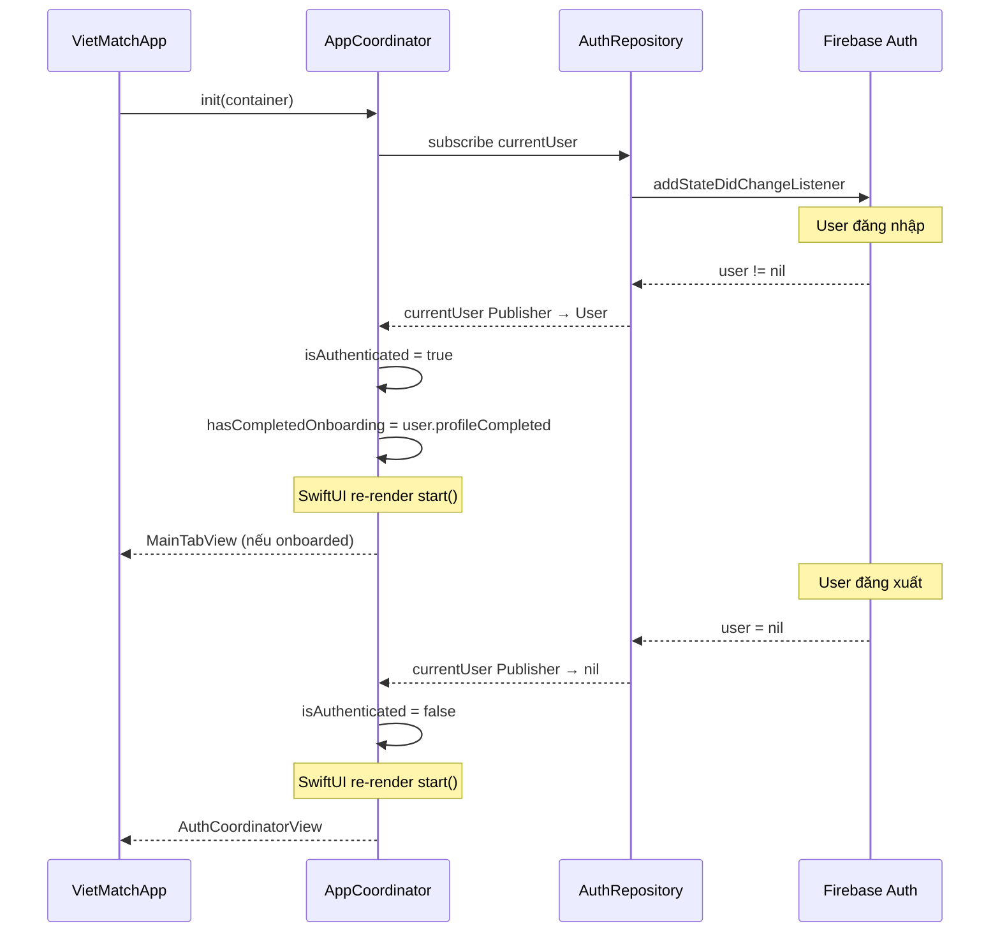

# VietMatch - Navigation Deep Dive

> Ngày tạo: 2026-03-26 | Phân tích chi tiết Coordinator Pattern

---

## 1. Tổng Quan

VietMatch sử dụng **Coordinator Pattern** kết hợp với **NavigationStack** (iOS 16+). Mỗi Coordinator là một `ObservableObject` quản lý navigation state (`NavigationPath`) và chịu trách nhiệm tạo Views thông qua **Swinject Container**.

### Các thành phần chính

| Thành phần | Vai trò |
|-----------|---------|
| `Coordinator` protocol | Định nghĩa interface chung (`start() -> ContentView`) |
| Route Enums | Type-safe navigation destinations cho từng Coordinator |
| `NavigationPath` | SwiftUI path-based navigation stack |
| `Swinject Container` | Inject dependencies (ViewModels, Services) vào Views |

### Các file liên quan

| File | Mô tả |
|------|-------|
| `Presentation/Navigation/Coordinator.swift` | Protocol + tất cả Route enums |
| `Presentation/Navigation/AppCoordinator.swift` | Root coordinator, auth state routing |
| `Presentation/Navigation/AuthCoordinator.swift` | Login / Register / ForgotPassword |
| `Presentation/Navigation/MainTabCoordinator.swift` | TabView 4 tabs |
| `Presentation/Navigation/DiscoverCoordinator.swift` | Discover / ProfileDetail |
| `Presentation/Navigation/ChatCoordinator.swift` | Conversations / Chat |
| `Presentation/Navigation/ProfileCoordinator.swift` | Profile / EditProfile / Settings |

---

## 2. Coordinator Protocol & Route Enums

### Protocol

```swift
// Coordinator.swift
protocol Coordinator: ObservableObject {
    associatedtype ContentView: View
    func start() -> ContentView
}
```

Mỗi Coordinator conform protocol này, cung cấp method `start()` trả về root View.

### Route Enums

Mỗi Coordinator có Route enum riêng, tất cả conform `Hashable` để tương thích với `NavigationPath`:

```swift
enum AppRoute: Hashable {
    case login, register, onboarding, mainTab
    case profileDetail(profileId: String)
    case chat(matchId: String)
    case editProfile, settings
}

enum AuthRoute: Hashable {
    case login, register, forgotPassword
}

enum DiscoverRoute: Hashable {
    case discover
    case profileDetail(profileId: String)
}

enum ChatRoute: Hashable {
    case conversations
    case chat(matchId: String)
}

enum ProfileRoute: Hashable {
    case profile, editProfile, settings
}
```

---

## 3. Sơ Đồ Tổng Hợp

```
VietMatchApp (@main)
└── AppCoordinatorView (@StateObject)
    └── AppCoordinator (Combine: observe auth state)
        │
        ├── [!authenticated] ─── AuthCoordinatorView
        │   └── NavigationStack(path)
        │       ├── LoginView (root)
        │       ├── → RegisterView (push)
        │       └── → ForgotPasswordView (push, placeholder)
        │
        ├── [authenticated, !onboarded] ─── OnboardingView
        │   └── 4-step wizard (không dùng NavigationStack)
        │
        └── [authenticated, onboarded] ─── MainTabView
            └── TabView(selection)
                │
                ├── Tab 0: DiscoverCoordinatorView
                │   └── NavigationStack(path)
                │       ├── DiscoverView (root)
                │       └── → ProfileDetailView (push, placeholder)
                │
                ├── Tab 1: MatchesView (không có Coordinator)
                │
                ├── Tab 2: ChatCoordinatorView
                │   └── NavigationStack(path)
                │       ├── ConversationsView (root)
                │       └── → ChatView(matchId) (push)
                │
                └── Tab 3: ProfileCoordinatorView
                    └── NavigationStack(path)
                        ├── ProfileView (root)
                        ├── → EditProfileView (push)
                        └── → SettingsView (push)
```

---

## 4. Chi Tiết Từng Coordinator

### 4.1 AppCoordinator — Root (Bộ não điều hướng)

**File:** `Presentation/Navigation/AppCoordinator.swift`

AppCoordinator **không dùng NavigationPath**. Thay vào đó, sử dụng 2 `@Published` flags để quyết định toàn bộ luồng ứng dụng:

```swift
final class AppCoordinator: ObservableObject {
    @Published var isAuthenticated = false
    @Published var hasCompletedOnboarding = false
    private let container: Container
    private var cancellables = Set<AnyCancellable>()
}
```

#### Cơ chế reactive

Khi khởi tạo, AppCoordinator subscribe vào `AuthRepository.currentUser` Publisher:

```swift
private func observeAuthState() {
    let authRepo = container.resolve(AuthRepositoryProtocol.self)!
    authRepo.currentUser
        .receive(on: DispatchQueue.main)
        .sink { [weak self] user in
            self?.isAuthenticated = user != nil
            if let user {
                self?.hasCompletedOnboarding = user.profileCompleted
            }
        }
        .store(in: &cancellables)
}
```

**Luồng hoạt động:**

```
Firebase Auth state thay đổi
  → AuthRepository.currentUser Publisher phát tín hiệu
    → AppCoordinator.isAuthenticated / hasCompletedOnboarding cập nhật
      → SwiftUI re-render start()
        → Chuyển sang view phù hợp (có animation easeInOut)
```

#### Logic routing

```swift
@ViewBuilder
func start() -> some View {
    if isAuthenticated {
        if hasCompletedOnboarding {
            mainTabView()       // → MainTabCoordinator
        } else {
            onboardingView()    // → OnboardingView (4 steps)
        }
    } else {
        authView()              // → AuthCoordinator
    }
}
```

| Trạng thái | Kết quả |
|-----------|---------|
| `isAuthenticated = false` | Hiển thị AuthCoordinator (Login/Register) |
| `isAuthenticated = true`, `hasCompletedOnboarding = false` | Hiển thị OnboardingView |
| `isAuthenticated = true`, `hasCompletedOnboarding = true` | Hiển thị MainTabCoordinator |

#### AppCoordinatorView

```swift
struct AppCoordinatorView: View {
    @ObservedObject var coordinator: AppCoordinator

    var body: some View {
        coordinator.start()
            .animation(.easeInOut, value: coordinator.isAuthenticated)
    }
}
```

Khi `isAuthenticated` thay đổi, SwiftUI tự động animate transition giữa các màn hình.

---

### 4.2 AuthCoordinator — Luồng xác thực

**File:** `Presentation/Navigation/AuthCoordinator.swift`

Pattern tiêu chuẩn được lặp lại ở tất cả sub-coordinators. Gồm 3 phần:

#### Phần 1: Coordinator Class

```swift
final class AuthCoordinator: ObservableObject {
    @Published var path = NavigationPath()
    private let container: Container

    func showRegister() {
        path.append(AuthRoute.register)     // Push RegisterView
    }

    func showForgotPassword() {
        path.append(AuthRoute.forgotPassword) // Push ForgotPasswordView
    }

    func pop() {
        if !path.isEmpty {
            path.removeLast()               // Pop về màn trước
        }
    }
}
```

#### Phần 2: Route Resolver

```swift
@ViewBuilder
func destination(for route: AuthRoute) -> some View {
    switch route {
    case .login:          loginView()
    case .register:       registerView()
    case .forgotPassword: Text("Quên mật khẩu")  // Placeholder
    }
}
```

Mỗi route được map tới một View cụ thể. View được tạo thông qua Swinject:

```swift
func loginView() -> some View {
    let viewModel = container.resolve(LoginViewModel.self)!
    return LoginView(viewModel: viewModel, coordinator: self)
}
```

#### Phần 3: CoordinatorView

```swift
struct AuthCoordinatorView: View {
    @ObservedObject var coordinator: AuthCoordinator

    var body: some View {
        NavigationStack(path: $coordinator.path) {
            coordinator.loginView()                              // Root view
                .navigationDestination(for: AuthRoute.self) { route in
                    coordinator.destination(for: route)           // Route → View
                }
        }
    }
}
```

#### Luồng điều hướng

```
┌─────────────┐   tap "Đăng ký"   ┌───────────────┐
│  LoginView   │ ────────────────→ │ RegisterView   │
│  (root)      │   coordinator     │ (pushed)       │
│              │   .showRegister() │                │
│              │ ←──────────────── │                │
└─────────────┘   coordinator      └───────────────┘
                  .pop()

LoginView → tap "Đăng ký"
  → coordinator.showRegister()
    → path.append(.register)
      → NavigationStack push RegisterView

RegisterView → tap back
  → coordinator.pop()
    → path.removeLast()
      → NavigationStack pop về LoginView
```

---

### 4.3 MainTabCoordinator — Tab Bar chính

**File:** `Presentation/Navigation/MainTabCoordinator.swift`

Coordinator này **không dùng NavigationPath**. Quản lý `selectedTab` cho TabView:

```swift
final class MainTabCoordinator: ObservableObject {
    @Published var selectedTab: Tab = .discover
    private let container: Container

    enum Tab: Int, CaseIterable {
        case discover   // "Khám phá"  flame.fill
        case matches    // "Matches"   heart.fill
        case chat       // "Chat"      message.fill
        case profile    // "Hồ sơ"     person.fill
    }
}
```

#### 4 Tabs và cách tạo

| Tab | Method | Cách tạo View |
|-----|--------|--------------|
| Discover | `discoverView()` | Tạo `DiscoverCoordinator` → `.start()` |
| Matches | `matchesView()` | Resolve `MatchesViewModel` → tạo `MatchesView` trực tiếp |
| Chat | `chatView()` | Tạo `ChatCoordinator` → `.start()` |
| Profile | `profileView()` | Tạo `ProfileCoordinator` → `.start()` |

**Lưu ý:** Tab Matches **không có Coordinator riêng** — MatchesView được tạo trực tiếp. 3 tab còn lại đều có sub-coordinator riêng, mỗi cái sở hữu **NavigationStack riêng biệt**. Điều này nghĩa là navigation state của mỗi tab hoàn toàn độc lập.

#### MainTabView

```swift
struct MainTabView: View {
    @ObservedObject var coordinator: MainTabCoordinator

    var body: some View {
        TabView(selection: $coordinator.selectedTab) {
            coordinator.discoverView()
                .tabItem { Label("Khám phá", systemImage: "flame.fill") }
                .tag(MainTabCoordinator.Tab.discover)

            coordinator.matchesView()
                .tabItem { Label("Matches", systemImage: "heart.fill") }
                .tag(MainTabCoordinator.Tab.matches)

            coordinator.chatView()
                .tabItem { Label("Chat", systemImage: "message.fill") }
                .tag(MainTabCoordinator.Tab.chat)

            coordinator.profileView()
                .tabItem { Label("Hồ sơ", systemImage: "person.fill") }
                .tag(MainTabCoordinator.Tab.profile)
        }
        .tint(VietMatchColors.primary)
    }
}
```

---

### 4.4 DiscoverCoordinator

**File:** `Presentation/Navigation/DiscoverCoordinator.swift`

```
Root: DiscoverView (swipe cards)
  └── push: ProfileDetailView(profileId) ← placeholder hiện tại
```

| Method | Route | Kết quả |
|--------|-------|---------|
| `showProfileDetail(profileId:)` | `.profileDetail(profileId)` | Push ProfileDetailView |
| `pop()` | - | Pop về DiscoverView |

```swift
func discoverView() -> some View {
    let viewModel = container.resolve(DiscoverViewModel.self)!
    return DiscoverView(viewModel: viewModel, coordinator: self)
}
```

---

### 4.5 ChatCoordinator

**File:** `Presentation/Navigation/ChatCoordinator.swift`

```
Root: ConversationsView (danh sách hội thoại)
  └── push: ChatView(matchId)
```

| Method | Route | Kết quả |
|--------|-------|---------|
| `showChat(matchId:)` | `.chat(matchId)` | Push ChatView cho match cụ thể |
| `pop()` | - | Pop về ConversationsView |

**Điểm đặc biệt:** ChatViewModel được resolve với **argument** `matchId`:

```swift
func chatView(matchId: String) -> some View {
    let viewModel = container.resolve(ChatViewModel.self, argument: matchId)!
    return ChatView(viewModel: viewModel)
}
```

Swinject cho phép truyền `matchId` khi tạo ViewModel, giúp mỗi chat screen có context riêng biệt.

#### Luồng điều hướng

```
┌───────────────────┐   tap conversation   ┌────────────────┐
│ ConversationsView  │ ──────────────────→  │ ChatView       │
│ (danh sách chat)   │   coordinator        │ (matchId: "m1")│
│                    │   .showChat("m1")    │                │
│                    │ ←────────────────── │                │
└───────────────────┘   coordinator.pop()   └────────────────┘
```

---

### 4.6 ProfileCoordinator

**File:** `Presentation/Navigation/ProfileCoordinator.swift`

```
Root: ProfileView
  ├── push: EditProfileView
  └── push: SettingsView
```

| Method | Route | Kết quả |
|--------|-------|---------|
| `showEditProfile()` | `.editProfile` | Push EditProfileView |
| `showSettings()` | `.settings` | Push SettingsView |
| `pop()` | - | Pop về ProfileView |

#### Luồng điều hướng

```
┌──────────────┐   tap "Chỉnh sửa"   ┌─────────────────┐
│ ProfileView   │ ──────────────────→  │ EditProfileView  │
│               │                      │                  │
│               │   tap "Cài đặt"     ┌─────────────────┐
│               │ ──────────────────→  │ SettingsView     │
└──────────────┘                       └─────────────────┘
```

---

## 5. Điểm Khởi Đầu - VietMatchApp

**File:** `App/VietMatchApp.swift`

```swift
@main
struct VietMatchApp: App {
    @UIApplicationDelegateAdaptor(AppDelegate.self) var delegate
    @StateObject private var appCoordinator: AppCoordinator

    init() {
        let coordinator = AppContainer.shared.resolve(AppCoordinator.self)
        _appCoordinator = StateObject(wrappedValue: coordinator)
    }

    var body: some Scene {
        WindowGroup {
            AppCoordinatorView(coordinator: appCoordinator)
                .environmentObject(NetworkMonitor.shared)
        }
    }
}
```

**Luồng khởi tạo:**

```
1. VietMatchApp.init()
2. → AppContainer.shared.resolve(AppCoordinator.self)
3.   → Swinject tạo AppCoordinator(container:)
4.     → observeAuthState() subscribe Firebase Auth
5. → @StateObject giữ reference
6. VietMatchApp.body
7. → AppCoordinatorView render
8. → coordinator.start() quyết định view
9. → NetworkMonitor inject qua .environmentObject
```

---

## 6. Pattern Chung Của Sub-Coordinators

Tất cả sub-coordinators (Auth, Discover, Chat, Profile) đều tuân theo cùng một pattern 3 phần:

```swift
// PHẦN 1: Coordinator Class
final class XxxCoordinator: ObservableObject {
    @Published var path = NavigationPath()
    private let container: Container

    // Navigation methods
    func showSomething() { path.append(XxxRoute.something) }
    func pop() { if !path.isEmpty { path.removeLast() } }

    // Route → View resolver
    @ViewBuilder
    func destination(for route: XxxRoute) -> some View { ... }

    // View factory methods (resolve từ Swinject)
    func someView() -> some View {
        let vm = container.resolve(SomeViewModel.self)!
        return SomeView(viewModel: vm, coordinator: self)
    }
}

// PHẦN 2: CoordinatorView
struct XxxCoordinatorView: View {
    @ObservedObject var coordinator: XxxCoordinator

    var body: some View {
        NavigationStack(path: $coordinator.path) {
            coordinator.rootView()
                .navigationDestination(for: XxxRoute.self) { route in
                    coordinator.destination(for: route)
                }
        }
    }
}
```

**Ưu điểm của pattern này:**
- Views không biết về navigation logic (separation of concerns)
- Type-safe routing qua enum
- Testable — có thể mock coordinator trong tests
- Mỗi tab có NavigationStack riêng → navigation state độc lập
- Lazy view creation — Views chỉ được tạo khi cần

---

## 7. Sơ Đồ Luồng Dữ Liệu



---

## 8. Nhận Xét & Lưu Ý

### Hoạt động tốt

| Điểm | Chi tiết |
|------|---------|
| Type-safe routing | Route enums tách biệt cho từng Coordinator → không thể push route sai |
| Separation of concerns | Views không biết về navigation, chỉ gọi coordinator methods |
| DI xuyên suốt | Mọi Coordinator nhận Container, resolve dependencies lazily |
| Reactive auth state | Combine Publisher tự động chuyển đổi Auth ↔ MainTab |
| Independent nav stacks | Mỗi tab có NavigationStack riêng → không ảnh hưởng lẫn nhau |

### Cần lưu ý

| Điểm | Chi tiết |
|------|---------|
| `ForgotPasswordView` | Chưa implement — hiện là `Text("Quên mật khẩu")` placeholder |
| `ProfileDetailView` | Chưa implement — hiện là `Text("Profile Detail")` placeholder |
| MatchesView không có Coordinator | Nếu cần push detail screen sau này, phải thêm MatchesCoordinator |
| ProfileViewModel resolve mới | `editProfileView()` resolve **new instance** ProfileViewModel — có thể gây data không đồng bộ giữa ProfileView và EditProfileView |
| AppRoute enum | Được định nghĩa nhưng hiện chưa được sử dụng ở đâu — có thể là thiết kế cho tương lai |
