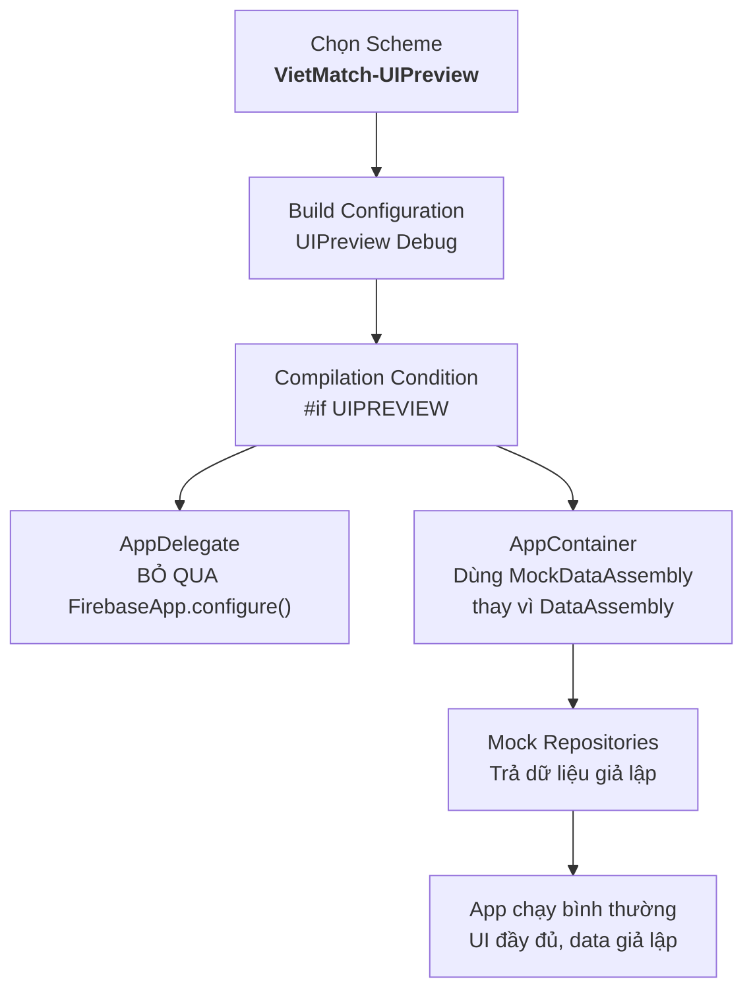

# UI Preview Scheme

> Hướng dẫn thiết lập Scheme chuyên dùng để xem và kiểm tra UI Flow — không kết nối Firebase, không API thật, chỉ Mock Data

---

## Tại sao cần UI Preview Scheme?

Khi phát triển giao diện, có nhiều tình huống ta chỉ muốn **xem UI** mà không cần backend:

- Designer review layout và animation
- Dev chỉnh UI mà không cần tài khoản Firebase
- Demo app cho stakeholder khi chưa có backend sẵn sàng
- Kiểm tra toàn bộ flow navigation: Login → Onboarding → Discover → Match → Chat
- Test edge cases UI: tên dài, ảnh thiếu, danh sách rỗng, loading state...

> Hình dung thế này: Scheme `VietMatch-UIPreview` giống như chế độ "mannequin" của một cửa hàng — mọi thứ trông y như thật, nhưng bên trong là mô hình tĩnh, không có "sự sống" từ server.

---

## Tổng quan giải pháp



**Nguyên lý hoạt động:**

Kiến trúc VietMatch dùng **Clean Architecture + DI (Swinject)**, nên toàn bộ ViewModels và Coordinators phụ thuộc vào **protocols**, không phụ thuộc concrete class. Ta chỉ cần **thay thế DataAssembly** (nơi đăng ký Firebase services + repositories thật) bằng **MockDataAssembly** (đăng ký mock repositories trả data giả lập).

```
┌─────────────────────────────────────────────────────┐
│                  Presentation Layer                  │
│  ViewModels · Coordinators · Views                  │
│  (KHÔNG thay đổi — dùng chung cho mọi scheme)       │
├─────────────────────────────────────────────────────┤
│                   Domain Layer                       │
│  Use Cases · Protocols · Entities                   │
│  (KHÔNG thay đổi — dùng chung cho mọi scheme)       │
├─────────────────────────────────────────────────────┤
│                    Data Layer                        │
│  ┌──────────────┐    ┌───────────────────────┐      │
│  │ DataAssembly  │    │  MockDataAssembly     │      │
│  │ (Firebase)    │    │  (In-memory data)     │      │
│  │ Dev/Stg/Prod  │    │  UIPreview scheme     │      │
│  └──────────────┘    └───────────────────────┘      │
└─────────────────────────────────────────────────────┘
```

---

## Bước 1: Thêm Build Configuration & Scheme vào project.yml

### 1.1. Thêm configs UIPreview

```yaml
configs:
  Dev Debug: debug
  Dev Release: release
  Staging Debug: debug
  Staging Release: release
  Production Debug: debug
  Production Release: release
  UIPreview Debug: debug        # ← Thêm mới
```

### 1.2. Thêm settings cho UIPreview trong target VietMatch

```yaml
targets:
  VietMatch:
    settings:
      configs:
        # ... (các config hiện tại giữ nguyên)
        UIPreview Debug:
          PRODUCT_BUNDLE_IDENTIFIER: com.vietmatch.app.uipreview
          PRODUCT_NAME: VM Preview
          ASSETCATALOG_COMPILER_APPICON_NAME: AppIcon
          SWIFT_ACTIVE_COMPILATION_CONDITIONS: DEBUG UIPREVIEW
          IPHONEOS_DEPLOYMENT_TARGET: "17.6"
```

### 1.3. Thêm scheme VietMatch-UIPreview

```yaml
schemes:
  # ... (các scheme hiện tại giữ nguyên)

  VietMatch-UIPreview:
    build:
      targets:
        VietMatch: all
    run:
      config: UIPreview Debug
    test:
      config: UIPreview Debug
      targets: []    # Không cần test trong scheme này
    profile:
      config: UIPreview Debug
    analyze:
      config: UIPreview Debug
    archive:
      config: UIPreview Debug
```

### 1.4. Cập nhật Test targets

```yaml
  VietMatchTests:
    settings:
      configs:
        # ... (các config hiện tại giữ nguyên)
        UIPreview Debug:
          TEST_HOST: "$(BUILT_PRODUCTS_DIR)/VM Preview.app/$(BUNDLE_EXECUTABLE_FOLDER_PATH)/VM Preview"
```

### 1.5. Regenerate Xcode project

```bash
xcodegen generate
```

---

## Bước 2: Tạo Mock Data Factory

Tạo file chứa dữ liệu giả lập — đây là "kho mannequin" mà toàn bộ mock repositories sẽ đọc từ đó.

### Vị trí file

```
VietMatch/
└── App/
    └── DI/
        └── Mock/
            ├── MockData.swift
            ├── MockDataAssembly.swift
            ├── MockAuthRepository.swift
            ├── MockProfileRepository.swift
            ├── MockMatchRepository.swift
            └── MockChatRepository.swift
```

### MockData.swift — Dữ liệu giả lập tập trung

```swift
#if UIPREVIEW

import Foundation

// MARK: - Mock Data Factory

enum MockData {

    // MARK: - Current User

    static let currentUserId = "mock-user-001"

    static let currentUser = User(
        id: currentUserId,
        email: "demo@vietmatch.app",
        displayName: "Minh Anh",
        profileCompleted: true,
        createdAt: Date().addingTimeInterval(-86400 * 30),
        lastActiveAt: Date()
    )

    // MARK: - Profiles

    static let currentProfile = Profile(
        id: currentUserId,
        name: "Minh Anh",
        age: 26,
        bio: "Thích đi cafe, đọc sách và chạy bộ mỗi sáng 🏃‍♀️",
        gender: .female,
        interestedIn: .male,
        photos: [
            "https://picsum.photos/seed/user1a/400/600",
            "https://picsum.photos/seed/user1b/400/600",
            "https://picsum.photos/seed/user1c/400/600"
        ],
        location: Location(latitude: 10.7769, longitude: 106.7009, city: "Hồ Chí Minh"),
        interests: ["Cafe", "Sách", "Chạy bộ", "Du lịch"],
        jobTitle: "UX Designer",
        company: "TechVN",
        school: "ĐH Bách Khoa HCM"
    )

    static let discoverProfiles: [Profile] = [
        Profile(
            id: "mock-user-002",
            name: "Thanh Tùng",
            age: 28,
            bio: "Software engineer by day, guitarist by night 🎸\nĐang tìm người cùng đi khám phá quán ăn mới",
            gender: .male,
            interestedIn: .female,
            photos: [
                "https://picsum.photos/seed/user2a/400/600",
                "https://picsum.photos/seed/user2b/400/600"
            ],
            location: Location(latitude: 10.7890, longitude: 106.7100, city: "Hồ Chí Minh"),
            interests: ["Guitar", "Coding", "Ẩm thực", "Phim"],
            jobTitle: "Senior Developer",
            company: "FPT Software",
            school: "ĐH Công Nghệ Thông Tin"
        ),
        Profile(
            id: "mock-user-003",
            name: "Hương Giang",
            age: 24,
            bio: "Cô gái Hà Nội vào Sài Gòn lập nghiệp ✈️ Thích nấu ăn và chụp hình",
            gender: .female,
            interestedIn: .male,
            photos: [
                "https://picsum.photos/seed/user3a/400/600",
                "https://picsum.photos/seed/user3b/400/600",
                "https://picsum.photos/seed/user3c/400/600",
                "https://picsum.photos/seed/user3d/400/600"
            ],
            location: Location(latitude: 10.7800, longitude: 106.6950, city: "Hồ Chí Minh"),
            interests: ["Nấu ăn", "Chụp hình", "Yoga", "Cà phê"],
            jobTitle: "Marketing Executive",
            company: "Shopee",
            school: "ĐH Ngoại Thương HN"
        ),
        Profile(
            id: "mock-user-004",
            name: "Đức Anh",
            age: 30,
            bio: "Bác sĩ tại BV Chợ Rẫy. Work-life balance là triết lý sống 🏥",
            gender: .male,
            interestedIn: .female,
            photos: [
                "https://picsum.photos/seed/user4a/400/600"
            ],
            location: Location(latitude: 10.7550, longitude: 106.6600, city: "Hồ Chí Minh"),
            interests: ["Y học", "Tennis", "Đọc sách", "Nấu ăn"],
            jobTitle: "Bác sĩ Nội khoa",
            company: "BV Chợ Rẫy",
            school: "ĐH Y Dược HCM"
        ),
        Profile(
            id: "mock-user-005",
            name: "Thùy Linh",
            age: 25,
            bio: "Giáo viên tiếng Anh, thích đi phượt và nuôi mèo 🐱",
            gender: .female,
            interestedIn: .male,
            photos: [
                "https://picsum.photos/seed/user5a/400/600",
                "https://picsum.photos/seed/user5b/400/600",
                "https://picsum.photos/seed/user5c/400/600",
                "https://picsum.photos/seed/user5d/400/600",
                "https://picsum.photos/seed/user5e/400/600",
                "https://picsum.photos/seed/user5f/400/600"
            ],
            location: Location(latitude: 10.8000, longitude: 106.7200, city: "Hồ Chí Minh"),
            interests: ["Du lịch", "Mèo", "Tiếng Anh", "Photography"],
            jobTitle: "English Teacher",
            company: "IELTS Academy",
            school: "ĐH Sư Phạm HCM"
        )
    ]

    // MARK: - Matches

    static let matches: [Match] = [
        Match(
            id: "match-001",
            userId: currentUserId,
            matchedUserId: "mock-user-003",
            matchedProfile: discoverProfiles[1], // Hương Giang
            createdAt: Date().addingTimeInterval(-86400 * 2),
            lastMessageAt: Date().addingTimeInterval(-3600),
            isNew: false
        ),
        Match(
            id: "match-002",
            userId: currentUserId,
            matchedUserId: "mock-user-005",
            matchedProfile: discoverProfiles[3], // Thùy Linh
            createdAt: Date().addingTimeInterval(-86400),
            lastMessageAt: nil,
            isNew: true
        )
    ]

    // MARK: - Messages

    static let messages: [Message] = [
        Message(
            id: "msg-001",
            matchId: "match-001",
            senderId: "mock-user-003",
            content: "Hey, mình thấy bạn cũng thích chụp hình! 📸",
            createdAt: Date().addingTimeInterval(-7200),
            isRead: true
        ),
        Message(
            id: "msg-002",
            matchId: "match-001",
            senderId: currentUserId,
            content: "Đúng rồi! Bạn hay chụp thể loại gì?",
            createdAt: Date().addingTimeInterval(-6800),
            isRead: true
        ),
        Message(
            id: "msg-003",
            matchId: "match-001",
            senderId: "mock-user-003",
            content: "Mình thích chụp street photography, cuối tuần hay đi quận 1 chụp lắm",
            createdAt: Date().addingTimeInterval(-6500),
            isRead: true
        ),
        Message(
            id: "msg-004",
            matchId: "match-001",
            senderId: currentUserId,
            content: "Nghe hay quá! Mình cũng đang tập chụp, có khi nào mình đi chụp chung không? 😄",
            createdAt: Date().addingTimeInterval(-3600),
            isRead: false
        )
    ]

    // MARK: - Conversations

    static let conversations: [Conversation] = [
        Conversation(
            id: "match-001",
            match: matches[0],
            lastMessage: messages.last,
            unreadCount: 0
        ),
        Conversation(
            id: "match-002",
            match: matches[1],
            lastMessage: nil,
            unreadCount: 0
        )
    ]
}

#endif
```

---

## Bước 3: Tạo Mock Repositories

Mỗi Mock Repository implement cùng protocol như repo thật, nhưng trả về dữ liệu từ `MockData` thay vì gọi Firebase.

### MockAuthRepository.swift

```swift
#if UIPREVIEW

import Foundation
import Combine

final class MockAuthRepository: AuthRepositoryProtocol {
    private let currentUserSubject = CurrentValueSubject<User?, Never>(MockData.currentUser)

    var currentUser: AnyPublisher<User?, Never> {
        currentUserSubject.eraseToAnyPublisher()
    }

    var isAuthenticated: Bool { true }

    func login(email: String, password: String) async throws -> User {
        try await Task.sleep(nanoseconds: 500_000_000) // Giả lập delay 0.5s
        return MockData.currentUser
    }

    func register(email: String, password: String, displayName: String) async throws -> User {
        try await Task.sleep(nanoseconds: 500_000_000)
        return MockData.currentUser
    }

    func loginWithGoogle() async throws -> User {
        try await Task.sleep(nanoseconds: 500_000_000)
        return MockData.currentUser
    }

    func loginWithApple(idToken: String, nonce: String) async throws -> User {
        try await Task.sleep(nanoseconds: 500_000_000)
        return MockData.currentUser
    }

    func logout() async throws {
        currentUserSubject.send(nil)
    }

    func resetPassword(email: String) async throws {
        try await Task.sleep(nanoseconds: 300_000_000)
    }

    func deleteAccount() async throws {
        currentUserSubject.send(nil)
    }
}

#endif
```

### MockProfileRepository.swift

```swift
#if UIPREVIEW

import Foundation

final class MockProfileRepository: ProfileRepositoryProtocol {
    func getProfile(userId: String) async throws -> Profile {
        try await Task.sleep(nanoseconds: 300_000_000)
        if userId == MockData.currentUserId {
            return MockData.currentProfile
        }
        return MockData.discoverProfiles.first { $0.id == userId }
            ?? MockData.discoverProfiles[0]
    }

    func updateProfile(_ profile: Profile) async throws -> Profile {
        try await Task.sleep(nanoseconds: 400_000_000)
        return profile // Trả về profile đã "cập nhật"
    }

    func uploadPhoto(userId: String, imageData: Data) async throws -> String {
        try await Task.sleep(nanoseconds: 800_000_000) // Upload giả lập lâu hơn
        return "https://picsum.photos/seed/uploaded\(Int.random(in: 1...999))/400/600"
    }

    func deletePhoto(userId: String, photoURL: String) async throws {
        try await Task.sleep(nanoseconds: 300_000_000)
    }

    func updateLocation(userId: String, location: Location) async throws {
        try await Task.sleep(nanoseconds: 200_000_000)
    }
}

#endif
```

### MockMatchRepository.swift

```swift
#if UIPREVIEW

import Foundation
import Combine

final class MockMatchRepository: MatchRepositoryProtocol {
    private var swipeCount = 0

    func swipe(swiperId: String, swipedUserId: String, direction: SwipeDirection) async throws -> Match? {
        try await Task.sleep(nanoseconds: 300_000_000)
        swipeCount += 1

        // Cứ mỗi 3 lần like → tạo match (để test UI match alert)
        if direction == .like && swipeCount % 3 == 0 {
            let matchedProfile = MockData.discoverProfiles.first { $0.id == swipedUserId }
            return Match(
                id: UUID().uuidString,
                userId: swiperId,
                matchedUserId: swipedUserId,
                matchedProfile: matchedProfile,
                isNew: true
            )
        }
        return nil
    }

    func getMatches(userId: String) async throws -> [Match] {
        try await Task.sleep(nanoseconds: 400_000_000)
        return MockData.matches
    }

    func getDiscoverProfiles(userId: String, limit: Int) async throws -> [Profile] {
        try await Task.sleep(nanoseconds: 500_000_000)
        return Array(MockData.discoverProfiles.prefix(limit))
    }

    func observeMatches(userId: String) -> AnyPublisher<[Match], Error> {
        Just(MockData.matches)
            .setFailureType(to: Error.self)
            .eraseToAnyPublisher()
    }

    func unmatch(matchId: String) async throws {
        try await Task.sleep(nanoseconds: 300_000_000)
    }
}

#endif
```

### MockChatRepository.swift

```swift
#if UIPREVIEW

import Foundation
import Combine

final class MockChatRepository: ChatRepositoryProtocol {
    func sendMessage(matchId: String, senderId: String, content: String, type: MessageType) async throws -> Message {
        try await Task.sleep(nanoseconds: 200_000_000)
        return Message(
            id: UUID().uuidString,
            matchId: matchId,
            senderId: senderId,
            content: content,
            type: type,
            createdAt: Date()
        )
    }

    func getMessages(matchId: String, limit: Int, before: Date?) async throws -> [Message] {
        try await Task.sleep(nanoseconds: 300_000_000)
        return MockData.messages.filter { $0.matchId == matchId }
    }

    func observeMessages(matchId: String) -> AnyPublisher<[Message], Error> {
        Just(MockData.messages.filter { $0.matchId == matchId })
            .setFailureType(to: Error.self)
            .eraseToAnyPublisher()
    }

    func getConversations(userId: String) async throws -> [Conversation] {
        try await Task.sleep(nanoseconds: 400_000_000)
        return MockData.conversations
    }

    func observeConversations(userId: String) -> AnyPublisher<[Conversation], Error> {
        Just(MockData.conversations)
            .setFailureType(to: Error.self)
            .eraseToAnyPublisher()
    }

    func markAsRead(matchId: String, userId: String) async throws {
        // No-op trong mock
    }
}

#endif
```

---

## Bước 4: Tạo MockDataAssembly

File này thay thế `DataAssembly` khi chạy scheme UIPreview — đăng ký mock implementations thay vì Firebase services.

### MockDataAssembly.swift

```swift
#if UIPREVIEW

import Foundation
import Swinject

final class MockDataAssembly: Assembly {
    func assemble(container: Container) {
        // MARK: - Mock Services

        // UserDefaultsService vẫn dùng thật (không phụ thuộc Firebase)
        container.register(UserDefaultsServiceProtocol.self) { _ in
            UserDefaultsService()
        }.inObjectScope(.container)

        // Seed currentUserId để các ViewModel resolve đúng
        let userDefaultsService = UserDefaultsService()
        userDefaultsService.set(MockData.currentUserId, forKey: UserDefaultsKey.currentUserId)

        // MARK: - Mock Repositories

        container.register(AuthRepositoryProtocol.self) { _ in
            MockAuthRepository()
        }.inObjectScope(.container)

        container.register(ProfileRepositoryProtocol.self) { _ in
            MockProfileRepository()
        }.inObjectScope(.container)

        container.register(MatchRepositoryProtocol.self) { _ in
            MockMatchRepository()
        }.inObjectScope(.container)

        container.register(ChatRepositoryProtocol.self) { _ in
            MockChatRepository()
        }.inObjectScope(.container)
    }
}

#endif
```

---

## Bước 5: Cập nhật AppContainer

Sửa `AppContainer.swift` để chọn đúng Assembly theo compilation condition:

```swift
import Foundation
import Swinject

final class AppContainer {
    static let shared = AppContainer()

    let container: Container

    private init() {
        container = Container()
        registerAssemblies()
    }

    private func registerAssemblies() {
        let assemblies: [Assembly] = [
            #if UIPREVIEW
            MockDataAssembly(),     // ← Mock: không Firebase, chỉ data giả lập
            #else
            DataAssembly(),         // ← Thật: Firebase services
            #endif
            DomainAssembly(),       // ← Dùng chung: Use Cases không đổi
            PresentationAssembly()  // ← Dùng chung: ViewModels không đổi
        ]
        let assembler = Assembler(assemblies, container: container)
        _ = assembler
    }

    func resolve<T>(_ type: T.Type) -> T {
        guard let resolved = container.resolve(type) else {
            fatalError("Could not resolve \(type)")
        }
        return resolved
    }

    func resolve<T>(_ type: T.Type, name: String) -> T {
        guard let resolved = container.resolve(type, name: name) else {
            fatalError("Could not resolve \(type) with name \(name)")
        }
        return resolved
    }
}
```

---

## Bước 6: Cập nhật AppDelegate

Sửa `AppDelegate.swift` để bỏ qua Firebase khi chạy UIPreview:

```swift
func application(
    _ application: UIApplication,
    didFinishLaunchingWithOptions launchOptions: [UIApplication.LaunchOptionsKey: Any]? = nil
) -> Bool {
    #if UIPREVIEW
    // UIPreview mode: không khởi tạo Firebase
    AppLogger.general.info("🎨 Running in UI Preview mode — Firebase disabled")
    #else
    if ProcessInfo.processInfo.environment["XCTestConfigurationFilePath"] == nil {
        FirebaseApp.configure()
        setupNotifications(application)
    }
    #endif
    return true
}
```

---

## Bước 7: Cấu hình Build Phase Script

Cập nhật script copy `GoogleService-Info.plist` (nếu đã có từ firebase-setup) để bỏ qua UIPreview:

```bash
# Bỏ qua UIPreview — không cần GoogleService-Info.plist
if [[ "${SWIFT_ACTIVE_COMPILATION_CONDITIONS}" == *"UIPREVIEW"* ]]; then
  echo "⏭️ UIPreview mode — skipping GoogleService-Info.plist"
  exit 0
fi

# ... phần còn lại của script copy plist theo môi trường
```

---

## Tổng kết: Cấu trúc file cần tạo/sửa

```
VietMatch/
├── App/
│   ├── AppDelegate.swift                    ← SỬA: thêm #if UIPREVIEW
│   ├── DI/
│   │   ├── AppContainer.swift               ← SỬA: thêm #if UIPREVIEW chọn Assembly
│   │   ├── DataAssembly.swift               (giữ nguyên)
│   │   ├── DomainAssembly.swift             (giữ nguyên)
│   │   ├── PresentationAssembly.swift       (giữ nguyên)
│   │   └── Mock/                            ← TẠO MỚI
│   │       ├── MockData.swift               ← Dữ liệu giả lập
│   │       ├── MockDataAssembly.swift       ← DI Assembly cho mock
│   │       ├── MockAuthRepository.swift     ← Mock xác thực
│   │       ├── MockProfileRepository.swift  ← Mock hồ sơ
│   │       ├── MockMatchRepository.swift    ← Mock ghép đôi
│   │       └── MockChatRepository.swift     ← Mock trò chuyện
│   └── VietMatchApp.swift                   (giữ nguyên — đã tự hoạt động)
└── project.yml                              ← SỬA: thêm config + scheme
```

### Files cần SỬA (2 files)

| File | Thay đổi |
|------|----------|
| `AppContainer.swift` | Thêm `#if UIPREVIEW` chọn `MockDataAssembly` |
| `AppDelegate.swift` | Thêm `#if UIPREVIEW` bỏ qua `FirebaseApp.configure()` |

### Files cần TẠO MỚI (6 files)

| File | Mục đích |
|------|----------|
| `Mock/MockData.swift` | Kho dữ liệu giả lập tập trung |
| `Mock/MockDataAssembly.swift` | DI Assembly đăng ký mock repos |
| `Mock/MockAuthRepository.swift` | Giả lập đăng nhập/đăng ký |
| `Mock/MockProfileRepository.swift` | Giả lập hồ sơ người dùng |
| `Mock/MockMatchRepository.swift` | Giả lập ghép đôi & discover |
| `Mock/MockChatRepository.swift` | Giả lập tin nhắn & hội thoại |

### Config cần SỬA (1 file)

| File | Thay đổi |
|------|----------|
| `project.yml` | Thêm `UIPreview Debug` config + `VietMatch-UIPreview` scheme |

---

## Cách sử dụng

### Chạy UI Preview

1. Mở Xcode
2. Chọn scheme **`VietMatch-UIPreview`** trên toolbar
3. Nhấn **Cmd + R** để chạy

App sẽ khởi động với:
- User đã đăng nhập (Minh Anh, 26 tuổi)
- Profile đã hoàn thành → vào thẳng **MainTab**
- 5 profiles trên Discover để swipe
- 2 matches có sẵn (1 có tin nhắn, 1 mới)
- Chat có 4 tin nhắn mẫu

### Kiểm tra từng flow

| Flow | Cách test |
|------|-----------|
| **Auth flow** | Sửa `MockAuthRepository` → set `currentUserSubject.send(nil)` mặc định |
| **Onboarding** | Sửa `MockData.currentUser.profileCompleted = false` |
| **Discover + Swipe** | Chạy bình thường, cứ 3 lần like sẽ match |
| **Chat** | Vào conversation đầu tiên, đã có 4 tin nhắn |
| **Empty states** | Trả mảng rỗng trong mock repository tương ứng |
| **Loading states** | Tăng `Task.sleep` duration trong mock methods |
| **Error states** | Throw error trong mock methods thay vì return data |

### Tùy chỉnh dữ liệu

Muốn thêm profiles? Sửa `MockData.discoverProfiles`.
Muốn test tên dài? Sửa `name` trong `MockData`.
Muốn test 0 ảnh? Để `photos: []` trong profile.

> Mọi tùy chỉnh chỉ cần sửa trong `MockData.swift` — một file duy nhất, không ảnh hưởng gì đến code production.

---

## Lưu ý quan trọng

1. **Tất cả file Mock nằm trong `#if UIPREVIEW`** → code mock sẽ bị compiler loại bỏ hoàn toàn khi build Dev/Staging/Production. Không tăng kích thước app release.

2. **Không cần `GoogleService-Info.plist`** khi chạy UIPreview — tiện cho dev mới join team, chưa có quyền truy cập Firebase Console.

3. **DomainAssembly và PresentationAssembly không đổi** — Use Cases vẫn chạy validation logic thật (ví dụ: check email hợp lệ, password ≥ 6 ký tự). Chỉ tầng Data được mock.

4. **Ảnh dùng `picsum.photos`** — service trả ảnh random miễn phí. Nếu muốn chạy offline hoàn toàn, có thể thay bằng ảnh trong Assets.xcassets.

5. **`Task.sleep` trong mock** — giả lập network delay để kiểm tra loading states. Có thể điều chỉnh hoặc bỏ tùy nhu cầu.
